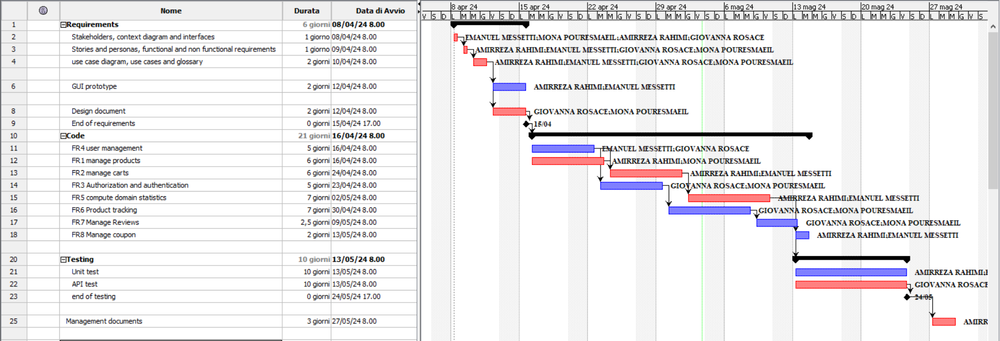

# Project Estimation - FUTURE

Date: 05/05/2024

Version: v2

# Estimation approach

Consider the EZElectronics  project in FUTURE version (as proposed by your team in requirements V2), assume that you are going to develop the project INDEPENDENT of the deadlines of the course, and from scratch (not from V1)

# Estimate by size

|                                                                                                         | Estimate |
| ------------------------------------------------------------------------------------------------------- | -------- |
| NC =  Estimated number of classes to be developed                                                       | 26       |
| A = Estimated average size per class, in LOC                                                            | 300      |
| S = Estimated size of project, in LOC (= NC * A)                                                        | 7800     |
| E = Estimated effort, in person hours (here use productivity 10 LOC per person hour)                    | 780      |
| C = Estimated cost, in euro (here use 1 person hour cost = 30 euro)                                     | 23400    |
| Estimated calendar time, in calendar weeks (Assume team of 4 people, 8 hours per day, 5 days per week ) | 5        |

# Estimate by product decomposition

| component name       | Estimated effort (person hours) |
| -------------------- | ------------------------------- |
| requirement document | 35                              |
| GUI prototype        | 30                              |
| design document      | 35                              |
| code                 | 300                             |
| unit tests           | 90                              |
| api tests            | 80                              |
| management documents | 28                              |

# Estimate by activity decomposition

| Activity name                                                    | Estimated effort (person hours) |
| ---------------------------------------------------------------- | ------------------------------- |
| Stakeholders, context diagram and interfaces                     | 6                               |
| Stories and personas, functional and non functional requirements | 8                               |
| Use case diagram, use cases and glossary                         | 22                              |
| GUI prototype                                                    | 30                              |
| Design document                                                  | 35                              |
| FR4 user management                                              | 60                              |
| FR1 manage products                                              | 120                             |
| FR2 manage carts                                                 | 60                              |
| FR3 Authorization and authentication                             | 60                              |
| Unit test                                                        | 90                              |
| API test                                                         | 80                              |
| Management documents                                             | 28                              |

# Summary

Estimation by size is considered while all the people working in parallel 8 hours a day, so it would be obvious if more effort is done in less days using this method. On the other hand, estimating by product and activity can result in a more accurate effort number and the duration is real due to working with a part-time method.

|                                    | Estimated effort | Estimated duration |
| ---------------------------------- | ---------------- | ------------------ |
| estimate by size                   | 780              | 5                  |
| estimate by product decomposition  | 598              | 8                  |
| estimate by activity decomposition | 598              | 8                  |
