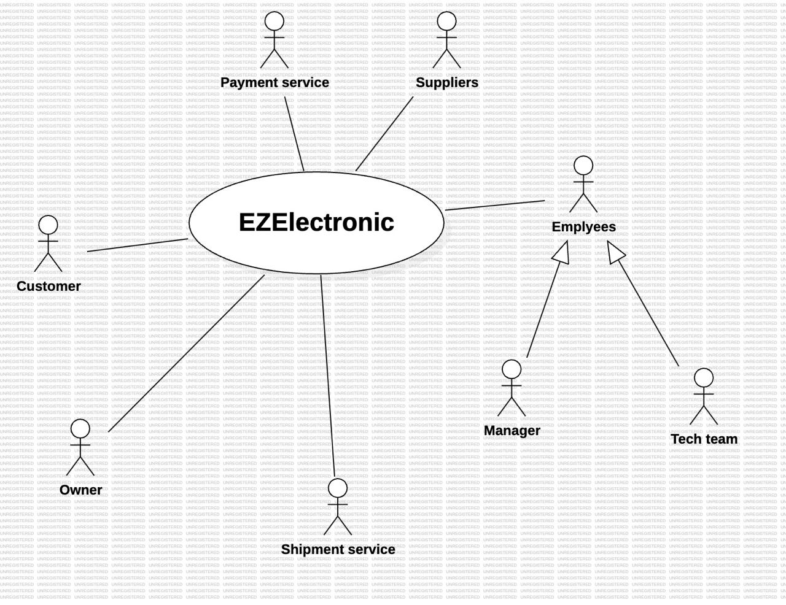

# Requirements Document - current EZElectronics

Date: 22/04/2024

Version: V1 - description of EZElectronics in CURRENT form (as received by teachers)

| Version number |                            Change                            |
| :------------: | :-----------------------------------------------------------: |
|      1.4      | Functional and non functional requirements + table of rights |

# Contents

- [Requirements Document - current EZElectronics](#requirements-document---current-ezelectronics)
- [Contents](#contents)
- [Informal description](#informal-description)
- [Stakeholders](#stakeholders)
- [Context Diagram and interfaces](#context-diagram-and-interfaces)
  - [Context Diagram](#context-diagram)
  - [Interfaces](#interfaces)
- [Stories and personas](#stories-and-personas)
- [Functional and non functional requirements](#functional-and-non-functional-requirements)
  - [Functional Requirements](#functional-requirements)
  - [Non Functional Requirements](#non-functional-requirements)
- [Use case diagram and use cases](#use-case-diagram-and-use-cases)
  - [Use case diagram](#use-case-diagram)
    - [Use case 1, UC1](#use-case-1-uc1)
      - [Scenario 1.1](#scenario-11)
      - [Scenario 1.2](#scenario-12)
      - [Scenario 1.x](#scenario-1x)
    - [Use case 2, UC2](#use-case-2-uc2)
    - [Use case x, UCx](#use-case-x-ucx)
- [Glossary](#glossary)
- [System Design](#system-design)
- [Deployment Diagram](#deployment-diagram)

# Informal description

EZElectronics (read EaSy Electronics) is a software application designed to help managers of electronics stores to manage their products and offer them to customers through a dedicated website. Managers can assess the available products, record new ones, and confirm purchases. Customers can see available products, add them to a cart and see the history of their past purchases.

# Stakeholders

| Stakeholder name |                                                                  Description                                                                  |
| :--------------: | :-------------------------------------------------------------------------------------------------------------------------------------------: |
|     Manager     |                                                       Manages products and their supply                                                       |
|     Customer     |                                  People who wants to buy electronics products such as laptops or smartphones                                  |
|  Business owner  |                            Company executives or stakeholders with a financial interest in the platform's success                            |
| Payment service |                                                    Offers several ways to pay for products                                                    |
|    Suppliers    |                                        Electronics companies who provide the electronics to the store                                        |
| Shipping service |                                                    Offers different ways to ship products                                                    |
|    Tech team    | Software engineers and IT professionals responsible for developing, maintaining the system and ensuring the security and privacy of user data |

# Context Diagram and interfaces

## Context Diagram

## Interfaces

|      Actor      |      Logical Interface      | Physical Interface |
| :--------------: | :-------------------------: | :----------------: |
|     Customer     |   the GUI of the website   |   PC/Smartphone   |
|     Manager     |   the GUI of the website   |   PC/Smartphone   |
| Payment service |             API             |      Internet      |
| Shipping service | https://www.poste.it/  etc. |      Internet      |
|  Business owner  |   the GUI of the website   |   PC/Smartphone   |
|    Tech team    |   the GUI of the website   |         PC         |

# Stories and personas

#### **Customer Persona**

* **Name**: Alice Johnson
* **Age**: 30

* **Occupation**: Software Engineer
* **Role**: Customer

* **Background**: Alice is a frequent online shopper who likes technology gadgets. She prefers seamless experiences and is familiar with EZElectronics platforms.
* **Goals**:

    Find and purchase products quickly and easily.

    View the contents of her shopping cart and complete the checkout process without delays.

    Track payment status and view past purchases.

#### Manager Persona

* **Name**: Bob Stevens
* **Age**: 45

* **Occupation**: Store Manager
* **Role**: Manager

* **Background**: Bob is responsible for managing the online store. He has experience in retail and supervises customer orders.
* **Goals**:

    Add and delete products in the store and check availability.

    View and manage customer carts, including marking them as paid.

    Ensure smooth operation of the EZElectronics platform.

**Customer Stories:**

A young girl who has just enrolled in a new scientific university, looking at his course of study, realizes that he needs a new computer to follow the lectures and use all the software useful for his studies. She doesn't have much time to shop in the shop, so she looks for a convenient and reliable option online.

**Manager Stories:**

The manager of EZElectronics, wants to increase sales and remain competitive. He would like to keep track of products and sales efficiently, reach more customers and promote his products.

# Functional and non functional requirements

## Functional Requirements

| ID            |                                                  Description                                                  |
| :------------ | :-----------------------------------------------------------------------------------------------------------: |
| **FR1** |                                           **Manage products**                                           |
| FR1.1         |               Add a set of products or a single product, delete products from the product list               |
| FR1.2         |                                            Mark a product as sold                                            |
| FR1.3         |                            Retrieve a list of products (by model, category or id)                            |
| **FR2** |                                            **Manage carts**                                            |
| FR2.1         |                                   Create or delete a cart for a single user                                   |
| FR2.2         |                                               Check out a cart                                               |
| FR2.3         |                                      Retrieve the cart list from a user                                      |
| FR2.4         |                                          Adds a product to the cart                                          |
| **FR3** |                                  **Authorization and authentication**                                  |
| FR3.1         |                                              Log in and log out                                              |
| FR3.2         |                           Retrieves information about the currently logged in user                           |
| **FR4** |                                            **Manage users**                                            |
| FR4.1         | Create user with provided information like(username, PSW, ...)or delete user (a specific user or all of them) |
| FR4.2         |                                 Retrieve a list of users (by username, role)                                 |

## Table of rights

|                      | **FR1.1 FR1.2** | **FR1.3** | FR2.1 FR2.3 FR2.4 | **FR2.2** | **FR3.1 FR3.2** | FR4 |
| :------------------: | :------------------------: | :-------------: | :-------------------------: | --------------- | -------------------------- | --- |
|  **Manager**  |             Y             |        Y        |              Y              | N               | Y                          | Y   |
|  **Customer**  |             N             |        Y        |              Y              | Y               | Y                          | N   |
| **Tech admin** |             N             |        Y        |              Y              | N               | Y                          | N   |

## Non Functional Requirements

|  ID  | Type (efficiency, reliability, ..) |                                        Description                                        | Refers to |
| :--: | :--------------------------------: | :---------------------------------------------------------------------------------------: | :-------: |
| NFR1 |             Usability             |            Application should be used with no specific training for the users            |  ALL FR  |
| NFR2 |             Efficiency             |                        All functions should complete in < 0.5 sec                        |  ALL FR  |
| NFR3 |            Reliability            | The frontend service must be always up, at least to serve an information page to the user |  ALL FR  |
| NFR4 |          Maintainability          |             Adding or updating a function must always take no more than 16 ph             |  ALL FR  |
| NFR5 |            Portability            |                      The site must be usable on all kind of devices                      |  ALL FR  |
| NFR6 |              Security              | The user's password should be hashed. Only the hashed value may be stored in the database | FR3 - FR4 |
| NFR7 |              Privacy              |              The data of a customer should not be disclosed outside the site              | FR3 - FR4 |

# Use case diagram and use cases

## Use case diagram

\<define here UML Use case diagram UCD summarizing all use cases, and their relationships>

\<next describe here each use case in the UCD>

### Use case 1, UC1

| Actors Involved |                                                                      |
| :--------------: | :------------------------------------------------------------------: |
|   Precondition   | \<Boolean expression, must evaluate to true before the UC can start> |
|  Post condition  |  \<Boolean expression, must evaluate to true after UC is finished>  |
| Nominal Scenario |         \<Textual description of actions executed by the UC>         |
|     Variants     |                      \<other normal executions>                      |
|    Exceptions    |                        \<exceptions, errors >                        |

##### Scenario 1.1

\<describe here scenarios instances of UC1>

\<a scenario is a sequence of steps that corresponds to a particular execution of one use case>

\<a scenario is a more formal description of a story>

\<only relevant scenarios should be described>

|  Scenario 1.1  |                                                                            |
| :------------: | :------------------------------------------------------------------------: |
|  Precondition  | \<Boolean expression, must evaluate to true before the scenario can start> |
| Post condition |  \<Boolean expression, must evaluate to true after scenario is finished>  |
|     Step#     |                                Description                                |
|       1       |                                                                            |
|       2       |                                                                            |
|      ...      |                                                                            |

##### Scenario 1.2

##### Scenario 1.x

### Use case 2, UC2

..

### Use case x, UCx

..

# Glossary

\<use UML class diagram to define important terms, or concepts in the domain of the application, and their relationships>

\<concepts must be used consistently all over the document, ex in use cases, requirements etc>

# System Design

\<describe here system design>

\<must be consistent with Context diagram>

# Deployment Diagram

\<describe here deployment diagram >
