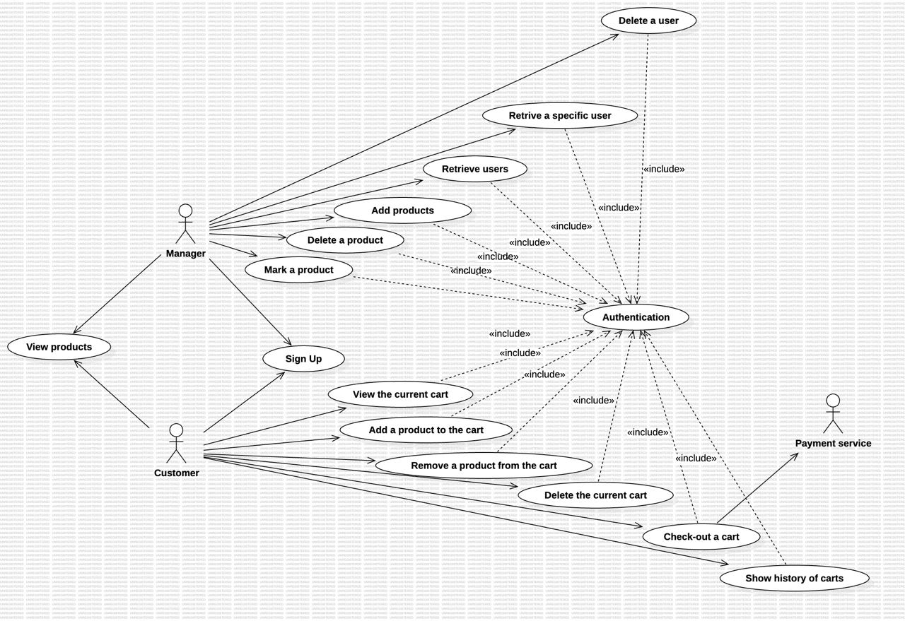

# Requirements Document - current EZElectronics

Date: 27/04/2024

Version: V1 - description of EZElectronics in CURRENT form (as received by teachers)

| Version number |               Change               |
| :------------: | :--------------------------------: |
|      1.9      | Add Use case diagram and use cases |

# Contents

- [Requirements Document - current EZElectronics](#requirements-document---current-ezelectronics)
- [Contents](#contents)
- [Informal description](#informal-description)
- [Stakeholders](#stakeholders)
- [Context Diagram and interfaces](#context-diagram-and-interfaces)
  - [Context Diagram](#context-diagram)
  - [Interfaces](#interfaces)
- [Stories and personas](#stories-and-personas)
- [Functional and non functional requirements](#functional-and-non-functional-requirements)
  - [Functional Requirements](#functional-requirements)
  - [Non Functional Requirements](#non-functional-requirements)
- [Use case diagram and use cases](#use-case-diagram-and-use-cases)
  - [Use case diagram](#use-case-diagram)
    - [Use case 1, UC1](#use-case-1-uc1)
      - [Scenario 1.1](#scenario-11)
      - [Scenario 1.2](#scenario-12)
      - [Scenario 1.x](#scenario-1x)
    - [Use case 2, UC2](#use-case-2-uc2)
    - [Use case x, UCx](#use-case-x-ucx)
- [Glossary](#glossary)
- [System Design](#system-design)
- [Deployment Diagram](#deployment-diagram)

# Informal description

EZElectronics (read EaSy Electronics) is a software application designed to help managers of electronics stores to manage their products and offer them to customers through a dedicated website. Managers can assess the available products, record new ones, and confirm purchases. Customers can see available products, add them to a cart and see the history of their past purchases.

# Stakeholders

| Stakeholder name |                                 Description                                 |
| :--------------: | :-------------------------------------------------------------------------: |
|     Manager     |                      Manages products and their supply                      |
|     Customer     | People who wants to buy electronics products such as laptops or smartphones |
| Payment service |                   Offers several ways to pay for products                   |

# Context Diagram and interfaces

## Context Diagram

## Interfaces

|      Actor      |   Logical Interface   | Physical Interface |
| :-------------: | :--------------------: | :----------------: |
|    Customer    | the GUI of the website |   PC/Smartphone   |
|     Manager     | the GUI of the website |   PC/Smartphone   |
| Payment service |          API          |      Internet      |

# Stories and personas

#### **Customer Persona**

* **Name**: Alice Johnson
* **Age**: 30
* **Occupation**: Software Engineer
* **Role**: Customer
* **Background**: Alice is a frequent online shopper who likes technology gadgets. She prefers seamless experiences and is familiar with EZElectronics platforms.
* **Goals**:

  Find and purchase products quickly and easily.

  View the contents of her shopping cart and complete the checkout process without delays.

  Track payment status and view past purchases.

#### Manager Persona

* **Name**: Bob Stevens
* **Age**: 45
* **Occupation**: Store Manager
* **Role**: Manager
* **Background**: Bob is responsible for managing the online store. He has experience in retail and supervises customer orders.
* **Goals**:

  Add and delete products in the store and check availability.

  View and manage customer carts, including marking them as paid.

  Ensure smooth operation of the EZElectronics platform.

**Customer Stories:**

Alice seeks a smooth and intuitive online shopping experience, with easy navigation, detailed product descriptions, quick addition of items to her cart, and hassle-free purchase completion.

**Manager Stories:**

Bob leads an electronics store, managing stock, purchases, and product selection. Seeking efficiency, Bob desires an intuitive application for real-time stock monitoring and easy product management. Bob also prioritizes a user-friendly interface to streamline customer transactions.

# Functional and non functional requirements

## Functional Requirements

| ID            |                                       Description                                       |
| :------------ | :--------------------------------------------------------------------------------------: |
| **FR1** |                                **Manage products**                                |
| FR1.1         |                             Add a product, delete a product                             |
| FR1.2         |                                  Mark a product as sold                                  |
| FR1.3         |                    Retrieve a list of products (by model or category)                    |
| FR1.4         |               Registers the arrival of a set of products of the same model               |
| **FR2** |                                  **Manage carts**                                  |
| FR2.1         |            Removes a product from the current cart , Deletes the current cart            |
| FR2.2         |                                     Check out a cart                                     |
| FR2.3         |                                  View the current cart                                  |
| FR2.4         |                                Adds a product to the cart                                |
| FR2.5         |                             Returns the history of the carts                             |
| **FR3** |                        **Authorization and authentication**                        |
| FR3.1         |                                    Log in and log out                                    |
| FR3.2         |                 Retrieves information about the currently logged in user                 |
| **FR4** |                                  **Manage users**                                  |
| FR4.1         |                                      Create a user                                      |
| FR4.2         | Delete a user , retrieve a list of users by their role , retrieve a user by the username |

## Table of rights

|                    | **FR1.1 FR1.2 FR1.4** | **FR1.3** | FR2.1 FR2.3 | **FR2.2 FR2.4** | FR2.5 | FR3 | FR4.1 | FR4.2 |
| :----------------: | :-----------------------------------: | :-------------: | :--------------: | -------------------------- | ----- | --- | ----- | ----- |
| **Manager** |                   Y                   |        Y        |        Y        | N                          | Y     | Y   | Y     | Y     |
| **Customer** |                   N                   |        Y        |        Y        | Y                          | N     | Y   | Y     | N     |

## Non Functional Requirements

|  ID  | Type (efficiency, reliability, ..) |                                        Description                                        | Refers to |
| :--: | :--------------------------------: | :---------------------------------------------------------------------------------------: | :-------: |
| NFR1 |             Usability             |            Application should be used with no specific training for the users            |  ALL FR  |
| NFR2 |             Efficiency             |                        All functions should complete in < 0.5 sec                        |  ALL FR  |
| NFR3 |            Reliability            | The frontend service must be always up, at least to serve an information page to the user |  ALL FR  |
| NFR4 |          Maintainability          |             Adding or updating a function must always take no more than 16 ph             |  ALL FR  |
| NFR5 |            Portability            |                      The site must be usable on all kind of devices                      |  ALL FR  |
| NFR6 |              Security              | The user's password should be hashed. Only the hashed value may be stored in the database | FR3 - FR4 |
| NFR7 |              Privacy              |              The data of a customer should not be disclosed outside the site              | FR3 - FR4 |

# Use case diagram and use cases

## Use case diagram

### Use case 1, UC1 - ***Add products : m**anager wants to add products to the database*

| Actors Involved |                      **Manager**                      |
| :--------------: | :---------------------------------------------------------: |
|   Precondition   |           Manager has an account and is logged in           |
|  Post condition  |                                                            |
| Nominal Scenario |                           ap1,ap2                           |
|     Variants     |                                                            |
|    Exceptions    | ap3(the product already exist), ap4(wrong arrivalDate), ap5 |

##### Scenario 1.1 - ap1

|  Scenario 1.1  |                                                Add a single product                                                |
| :------------: | :-----------------------------------------------------------------------------------------------------------------: |
|  Precondition  |                                     The manager has an account and is logged in                                     |
| Post condition |                                    The new product is added to the product list                                    |
|   *Step#*   |                                                   *Description*                                                   |
|       1       |                                   The manager selects "Add a New Product" button                                   |
|       2       | The manager enters the new product details (code, sellingPrice, model, category, arrivalDate, sellingDate, details) |
|       3       |                                     The manager clicks on "Save Product" button                                     |
|       4       |                        The system displays a success message indicating the product is saved                        |

##### Scenario 1.2 - ap2

|  Scenario 1.2  |                           **Register the arrival of a set of products of the same model**                           |
| :------------: | :-----------------------------------------------------------------------------------------------------------------------: |
|  Precondition  |                                        The manager has an account and is logged in                                        |
| Post condition |                             The arrival of a set of products of the same model is registered                             |
|   *Step#*   |                                                      *Description*                                                      |
|       1       |                                    The manager selects "Add a set of Products" button                                    |
|       2       | The manager enters the new product details ( quantity , sellingPrice, model, category, arrivalDate, sellingDate, details) |
|       3       |                                        The manager clicks on "Save Product" button                                        |
|       4       |                            The system displays a success message “the arrival is registered”                            |

##### Scenario 1.3 - ap3

|  Scenario 1.3  |                                         **Failed to add a single product**                                         |
| :------------: | :-----------------------------------------------------------------------------------------------------------------------: |
|  Precondition  |              The manager has an account and is logged in . The product's code already exist in the database              |
| Post condition |                                  The new product failed to be added to the product list                                  |
|   *Step#*   |                                                      *Description*                                                      |
|       1       |                                      The manager selects "Add a New Product" button                                      |
|       2       | The manager enters the new product details ( quantity , sellingPrice, model, category, arrivalDate, sellingDate, details) |
|       3       |                                        The manager clicks on "Save Product" button                                        |
|       4       |                          The system displays an error message “409- the product already exist”                          |

##### Scenario 1.4 - ap4

|  Scenario 1.4  |                                         **Failed to add a single product**                                         |
| :------------: | :-----------------------------------------------------------------------------------------------------------------------: |
|  Precondition  |                  The manager has an account and is logged in . The arrivalDate is after the current date                  |
| Post condition |                                  The new product failed to be added to the product list                                  |
|   *Step#*   |                                                      *Description*                                                      |
|       1       |                                      The manager selects "Add a New Product" button                                      |
|       2       | The manager enters the new product details ( quantity , sellingPrice, model, category, arrivalDate, sellingDate, details) |
|       3       |                                        The manager clicks on "Save Product" button                                        |
|       4       |                       The system displays an error message “arrivalDateis after the current date”                       |

##### Scenario 1.5 - ap5

|  Scenario 1.5  |                      **Failed to register the arrival of a set of products of the same model**                      |
| :------------: | :-----------------------------------------------------------------------------------------------------------------------: |
|  Precondition  |                                        The manager has an account and is logged in                                        |
| Post condition |                        The arrival of a set of products of the same model that failed to register                        |
|   *Step#*   |                                                      *Description*                                                      |
|       1       |                                      The manager selects "Add a New Product" button                                      |
|       2       | The manager enters the new product details ( quantity , sellingPrice, model, category, arrivalDate, sellingDate, details) |
|       3       |                                        The manager clicks on "Save Product" button                                        |
|       4       |                       The system displays an error message “arrivalDateis after the current date”                       |

### Use case 2, UC2 - ***Delete a product**: manager wants to delete products from the database***

| Actors Involved |            **Manager**            |
| :--------------: | :--------------------------------------: |
|   Precondition   | Manager has an account and is logged in |
|  Post condition  |                                          |
| Nominal Scenario |                   dp1                   |
|     Variants     |                                          |
|    Exceptions    | d2(there is no such a product to delete) |

##### Scenario 2.1 - dp1

|  Scenario 2.1  |                            **Delete a product**                            |
| :------------: | :------------------------------------------------------------------------------: |
|  Precondition  | The manager has an account and is logged in, the product is in the product list |
| Post condition |              The selected product is removed from the product list              |
|   *Step#*   |                                 *Description*                                 |
|       1       |                      The manager enters the product's code                      |
|       2       |                 The system will return the corresponding product                 |
|       3       |                   The manager clicks on the “delete” button                   |
|       4       | The system removes the product from the product list and shows a success message |

##### Scenario 2.2 - dp2

|  Scenario 2.2  |                              **Failed to delete a product**                              |
| :------------: | :--------------------------------------------------------------------------------------------: |
|  Precondition  | The manager has an account and is logged in, the manager enters the product's code incorrectly |
| Post condition |                     The selected product is removed from the product list                     |
|   *Step#*   |                                        *Description*                                        |
|       1       |                             The manager enters the product's code                             |
|       2       |                        The system will return the corresponding product                        |
|       3       |                          The manager clicks on the “delete” button                          |
|       4       |                  The system shows an error message  “404-product not found”                  |

### Use case 3, UC3 - ***Mark a product** **: m**anager wants to mark a product as sold*

| Actors Involved |                                                **Manager**                                                |
| :--------------: | :--------------------------------------------------------------------------------------------------------------: |
|   Precondition   |                                     Manager has an account and is logged in                                     |
|  Post condition  |                                                                                                                  |
| Nominal Scenario |                                                       mp1                                                       |
|     Variants     |                                                                                                                  |
|    Exceptions    | mp2(product not exist),mp3(selling date>current date),mp4(selling date< arrival date),mp5(product has been sold) |

##### Scenario 3.1 - mp1

|  Scenario 3.1  |                         **Mark a product as sold**                         |
| :------------: | :------------------------------------------------------------------------------: |
|  Precondition  | The manager has an account and is logged in, and the product is marked as unsold |
| Post condition |                    The product is marked as sold in the order                    |
|   *Step#*   |                                 *Description*                                 |
|       1       |                      The manager enters the product's code                      |
|       2       |                  The system returns the product and its details                  |
|       3       |     The manager marks the product as "sold" by entering “yes” in its field     |
|       4       |                  The manager enter “selling date” (optional)                  |
|       5       |                     The system displays a successful message                     |

##### Scenario 3.2 - mp2

|  Scenario 3.2  |                      **Failed to mark a product as sold-not found**                      |
| :------------: | :---------------------------------------------------------------------------------------------: |
|  Precondition  | The manager has an account and is logged in. The manager enters the product’s code incorrectly |
| Post condition |                      The product failed to be marked as sold in the order                      |
|   *Step#*   |                                         *Description*                                         |
|       1       |                              The manager enters the product's code                              |
|       2       |                    The system shows an error message 404-product not found"                    |

##### Scenario 3.3 - mp3

|  Scenario 3.3  |      **Failed to mark a product as sold- selling date>current date**      |
| :------------: | :------------------------------------------------------------------------------: |
|  Precondition  | The manager has an account and is logged in, and the product is marked as unsold |
| Post condition |               The product failed to be marked as sold in the order               |
|   *Step#*   |                                 *Description*                                 |
|       1       |                      The manager enters the product's code                      |
|       2       |                  The system returns the product and its details                  |
|       3       |     The manager marks the product as "sold" by entering “yes” in its field     |
|       4       |                  The manager enter “selling date” (optional)                  |
|       5       |    The system shows an error message”sellingDate is after the current date”    |

##### Scenario 3.4 - mp4

|  Scenario 3.4  |     **Failed to mark a product as sold - selling date< arrival date**     |
| :------------: | :------------------------------------------------------------------------------: |
|  Precondition  | The manager has an account and is logged in, and the product is marked as unsold |
| Post condition |               The product failed to be marked as sold in the order               |
|   *Step#*   |                                 *Description*                                 |
|       1       |                      The manager enters the product's code                      |
|       2       |                  The system returns the product and its details                  |
|       3       |     The manager marks the product as "sold" by entering “yes” in its field     |
|       4       |                  The manager enter “selling date” (optional)                  |
|       5       |   The system shows an error message”sellingDate is before the arrival date”   |

##### Scenario 3.5 - mp5

|  Scenario 3.5  |  **Failed to mark a product as sold - the product has been sold**  |
| :------------: | :----------------------------------------------------------------------: |
|  Precondition  |               The manager has an account and is logged in               |
| Post condition |           The product failed to be marked as sold in the order           |
|   *Step#*   |                             *Description*                             |
|       1       |                  The manager enters the product's code                  |
|       2       |              The system returns the product and its details              |
|       3       | The manager marks the product as "sold" by entering “yes” in its field |
|       4       | The system shows an error message “the product already has been sold” |

### Use case 4, UC4 - ***View products** **: u**ser wants to see the products on the database*

| Actors Involved |    **Manager or Customer**    |
| :--------------: | :----------------------------------: |
|   Precondition   | User has an account and is logged in |
|  Post condition  |                                      |
| Nominal Scenario |                 vp1                 |
|     Variants     |               vp3,vp4               |
|    Exceptions    |        vp2(product not found)        |

##### Scenario 4.1 - vp1

|  Scenario 4.1  |               **View all products**               |
| :------------: | :------------------------------------------------------: |
|  Precondition  |         The user has an account and is logged in         |
| Post condition |               Returns the list of products               |
|   *Step#*   |                     *Description*                     |
|       1       |        The User selects “products” section page        |
|       2       |    User filters by sold or unsold products (optional)    |
|       3       | The system retrieve the list of products and its details |

##### Scenario 4.2 - vp2

|  Scenario 4.2  |       **View specific products - unavailable**       |
| :------------: | :--------------------------------------------------------: |
|  Precondition  |          The user has an account and is logged in          |
| Post condition |                    Returns the product                    |
|   *Step#*   |                      *Description*                      |
|       1       |         The User selects “products” section page         |
|       2       |             The User is looking for a product             |
|       3       | The system shows an error message “404-product not found" |

##### Scenario 4.3 - vp3

|  Scenario 4.3  |     **View specific products - available**     |
| :------------: | :--------------------------------------------------: |
|  Precondition  |       The user has an account and is logged in       |
| Post condition |                 Returns the product                 |
|   *Step#*   |                   *Description*                   |
|       1       |      The User selects “products” section page      |
|       2       |  User searches for products that have not been sold  |
|       3       | The system shows the details of the selected product |

##### Scenario 4.4 - vp4

|  Scenario 4.4  |         **View specific products - model and category**         |
| :------------: | :--------------------------------------------------------------------: |
|  Precondition  |                The user has an account and is logged in                |
| Post condition |                      Returns the list of products                      |
|   *Step#*   |                            *Description*                            |
|       1       |             The User navigate to the “products” section             |
|       2       |         The User enters one of these fields (model, category)         |
|       3       |           User filters by sold or unsold products (optional)           |
|       4       | The system retrieve the list of products corresponding the given Field |

### Use case 5, UC5 - ***View the current cart**: **Customer wants to see the current cart***

| Actors Involved |            **Customer**            |
| :--------------: | :--------------------------------------: |
|   Precondition   | Customer has an account and is logged in |
|  Post condition  |                                          |
| Nominal Scenario |                   vc1                   |
|     Variants     |                                          |
|    Exceptions    | d2(there is no such a product to delete) |

##### Scenario 5.1 - vc1

|  Scenario 5.1  |               View the current cart               |
| :------------: | :-----------------------------------------------: |
|  Precondition  |   The Customer has an account and is logged in   |
| Post condition |           Returns the list of products           |
|   *Step#*   |                  *Description*                  |
|       1       |       The Customer selects “cart” section       |
|       2       | The system retrieves the current cart and details |

### Use case 6, UC6 - ***Add a product to the cart***: c*ustomer wants to add the products to the cart*

| Actors Involved |            **Costumer**            |
| :--------------: | :--------------------------------------: |
|   Precondition   | Customer has an account and is logged in |
|  Post condition  |                                          |
| Nominal Scenario |                   ac1                   |
|     Variants     |                                          |
|    Exceptions    |               ac2,ac3,ac4               |

##### Scenario 6.1 - ac1

|  Scenario 6.1  |              **Add a product to the cart**              |
| :------------: | :-----------------------------------------------------------: |
|  Precondition  |         The customer has an account and is logged in         |
| Post condition |              The products are added to the cart              |
|   *Step#*   |                        *Description*                        |
|       1       |          The customer navigates to the products page          |
|       2       |      The customer choose the products that is available      |
|       3       |              The customer Click on 'add to cart'              |
|       4       | The system will increase the quantity of products in the cart |
|       5       | The system displays the message 'Product added successfully' |

##### Scenario 6.2 - ac2

|  Scenario 6.2  |          **Failed to add a product to the cart - not found**          |
| :------------: | :-------------------------------------------------------------------------: |
|  Precondition  | The customer has an account and is logged in and unable to find the product |
| Post condition |                     The products are added to the cart                     |
|   *Step#*   |                               *Description*                               |
|       1       |                 The customer navigates to the products page                 |
|       2       |           The customer choose the products but it is unavailable           |
|       3       |                     The customer Click on 'add to cart'                     |
|       4       |     The system displays an error message “404- the product not found”     |

##### Scenario 6.3 - ac3

|  Scenario 6.3  |          **Failed to add a product to the cart - another cart**          |
| :------------: | :-----------------------------------------------------------------------------: |
|  Precondition  |   The customer has an account and is logged in and choose a duplicate product   |
| Post condition |                       The products are added to the cart                       |
|   *Step#*   |                                 *Description*                                 |
|       1       |                   The customer navigates to the products page                   |
|       2       |             The customer choose the products but it is unavailable             |
|       3       |                       The customer Click on 'add to cart'                       |
|       4       | The system displays the message '409- product that is already in another cart ' |

##### Scenario 6.4 - ac4

|  Scenario 6.4  |              **Failed to add a product to the cart - sold**              |
| :------------: | :----------------------------------------------------------------------------: |
|  Precondition  | The customer has an account and is logged in and choose an unavailable product |
| Post condition |                       The products are added to the cart                       |
|   *Step#*   |                                *Description*                                |
|       1       |                  The customer navigates to the products page                  |
|       2       |             The customer choose the products but it is unavailable             |
|       3       |                      The customer Click on 'add to cart'                      |
|       4       |     The system displays the message “409- product has already been sold”     |

# Glossary

\<use UML class diagram to define important terms, or concepts in the domain of the application, and their relationships>

\<concepts must be used consistently all over the document, ex in use cases, requirements etc>

# System Design

\<describe here system design>

\<must be consistent with Context diagram>

# Deployment Diagram

\<describe here deployment diagram >
