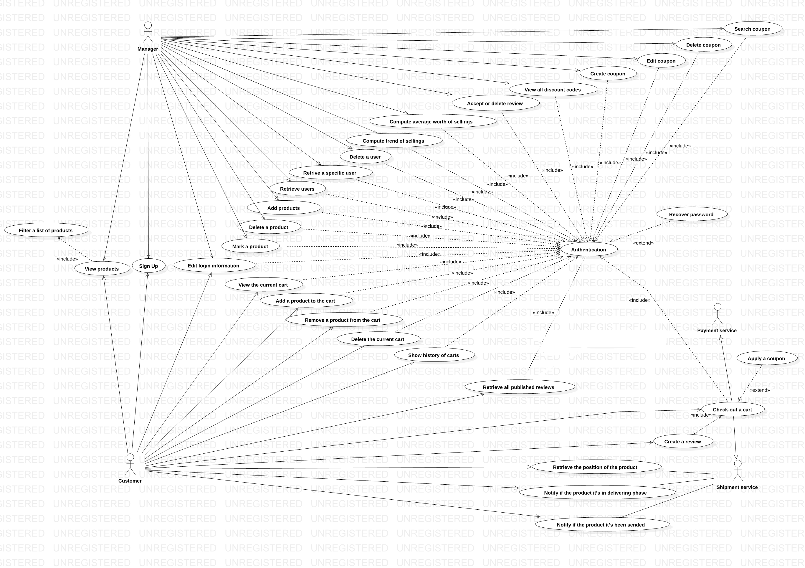
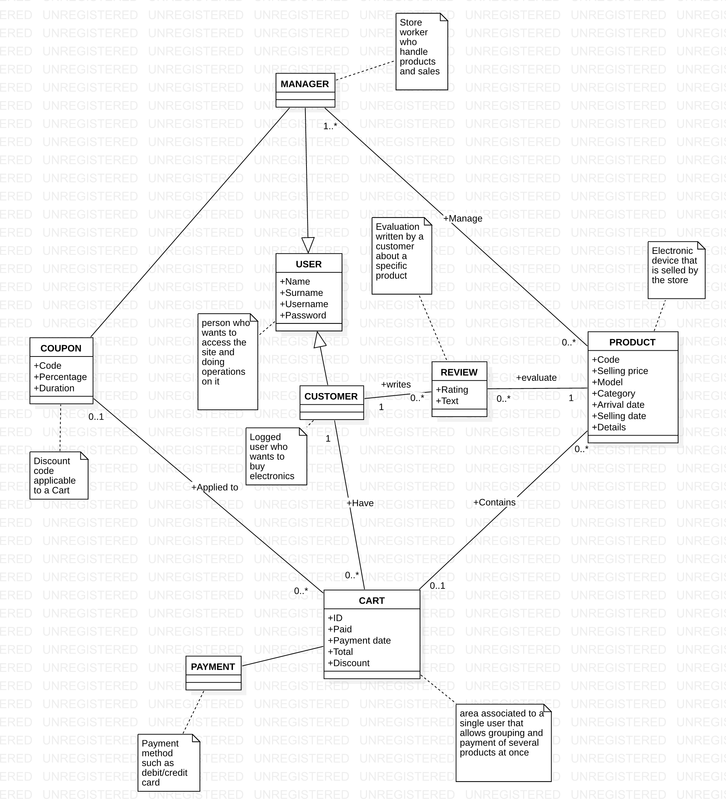

# Requirements Document - future EZElectronics

Date: 03/04/2024

Version: V2 - description of EZElectronics in FUTURE form (as proposed by the team)

| Version number |     Change     |
| :------------: | :-------------: |
|      1.9      | Adding Glossary |

# Contents

- [Requirements Document - future EZElectronics](#requirements-document-future-ezelectronics)
- [Contents](#contents)
- [Informal description](#informal-description)
- [Stakeholders](#stakeholders)
- [Context Diagram and interfaces](#context-diagram-and-interfaces)
  - [Context Diagram](#context-diagram)
  - [Interfaces](#interfaces)
- [Stories and personas](#stories-and-personas)
  - [Customer Persona](#customer-persona)
  - [Manager Persona](#manager-persona)
- [Functional and non functional requirements](#functional-and-non-functional-requirements)
  - [Functional Requirements](#functional-requirements)
  - [Table of rights](#table-of-rights)
  - [Non Functional Requirements](#non-functional-requirements)
- [Use case diagram and use cases](#use-case-diagram-and-use-cases)
  - [Use case diagram](#use-case-diagram)
    - [Use case 1, UC1 - *Add products : manager wants to add products to the database*](#use-case-1-uc1-add-products-manager-wants-to-add-products-to-the-database)
      - [Scenario 1.1 - ap1](#scenario-11-ap1)
      - [Scenario 1.2 - ap2](#scenario-12-ap2)
      - [Scenario 1.3 - ap3](#scenario-13-ap3)
      - [Scenario 1.4 - ap4](#scenario-14-ap4)
      - [Scenario 1.5 - ap5](#scenario-15-ap5)
    - [Use case 2, UC2 - *Delete a product: manager wants to delete products from the database*](#use-case-2-uc2-delete-a-product-manager-wants-to-delete-products-from-the-database)
      - [Scenario 2.1 - dp1](#scenario-21-dp1)
      - [Scenario 2.2 - dp2](#scenario-22-dp2)
    - [Use case 3, UC3 - *Mark a product: manager wants to mark a product as sold*](#use-case-3-uc3-mark-a-product-manager-wants-to-mark-a-product-as-sold)
      - [Scenario 3.1 - mp1](#scenario-31-mp1)
      - [Scenario 3.2 - mp2](#scenario-32-mp2)
      - [Scenario 3.3 - mp3](#scenario-33-mp3)
      - [Scenario 3.4 - mp4](#scenario-34-mp4)
      - [Scenario 3.5 - mp5](#scenario-35-mp5)
    - [Use case 4, UC4 - *View products: user wants to see the products on the database*](#use-case-4-uc4-view-products-user-wants-to-see-the-products-on-the-database)
      - [Scenario 4.1 - vp1](#scenario-41-vp1)
      - [Scenario 4.2 - vp2](#scenario-42-vp2)
      - [Scenario 4.3 - vp3](#scenario-43-vp3)
      - [Scenario 4.4 - vp4](#scenario-44-vp4)
    - [Use case 5, UC5 - *View the current cart: Customer wants to see the current cart*](#use-case-5-uc5-view-the-current-cart-customer-wants-to-see-the-current-cart)
      - [Scenario 5.1 - vc1](#scenario-51-vc1)
    - [Use case 6, UC6 - *Add a product to the cart: customer wants to add the products to the cart*](#use-case-6-uc6-add-a-product-to-the-cart-customer-wants-to-add-the-products-to-the-cart)
      - [Scenario 6.1 - ac1](#scenario-61-ac1)
      - [Scenario 6.2 - ac2](#scenario-62-ac2)
      - [Scenario 6.3 - ac3](#scenario-63-ac3)
      - [Scenario 6.4 - ac4](#scenario-64-ac4)
    - [Use case 7, UC7 - *Removes a product from the cart: customer wants to delete products from the cart*](#use-case-7-uc7-removes-a-product-from-the-cart-customer-wants-to-delete-products-from-the-cart)
      - [Scenario 7.1 - rc1](#scenario-71-rc1)
      - [Scenario 7.2 - rc2](#scenario-72-rc2)
      - [Scenario 7.3 - rc3](#scenario-73-rc3)
      - [Scenario 7.4 - rc4](#scenario-74-rc4)
      - [Scenario 7.5 - rc5](#scenario-75-rc5)
    - [Use case 8, UC8 - *Delete the current cart: customer wants to delete the current cart*](#use-case-8-uc8-delete-the-current-cart-customer-wants-to-delete-the-current-cart)
      - [Scenario 8.1 - dc1](#scenario-81-dc1)
      - [Scenario 8.2 - dc2](#scenario-82-dc2)
    - [Use case 9, UC9 - *Check out a cart: customer wants to check out the current cart*](#use-case-9-uc9-check-out-a-cart-customer-wants-to-check-out-the-current-cart)
      - [Scenario 9.1 - ck1](#scenario-91-ck1)
      - [Scenario 9.2 - ck2](#scenario-92-ck2)
      - [Scenario 9.3 - ck3](#scenario-93-ck3)
    - [Use case 10, UC10 - *Show the history of carts: customer wants to see the history of carts that have been paid*](#use-case-10-uc10-show-the-history-of-carts-customer-wants-to-see-the-history-of-carts-that-have-been-paid)
      - [Scenario 10.1 - sh1](#scenario-101-sh1)
    - [Use case 11, UC11 - *Retrieve users: manager wants to reach a list of the users*](#use-case-11-uc11-retrieve-users-manager-wants-to-reach-a-list-of-the-users)
      - [Scenario 11.1 - rur1](#scenario-111-rur1)
      - [Scenario 11.2 - ru2](#scenario-112-ru2)
    - [Use case 12, UC12 - *Retrieve a user by username: manager wants to reach a single user by its username*](#use-case-12-uc12-retrieve-a-user-by-username-manager-wants-to-reach-a-single-user-by-its-username)
      - [Scenario 12.1 - ruu1](#scenario-121-ruu1)
      - [Scenario 12.2 - ruu2](#scenario-122-ruu2)
    - [Use case 13, UC13 - *Delete a user: manager wants to delete an existing user by its username*](#use-case-13-uc13-delete-a-user-manager-wants-to-delete-an-existing-user-by-its-username)
      - [Scenario 13.1 - duu1](#scenario-131-duu1)
      - [Scenario 13.2 - duu2](#scenario-132-duu2)
    - [Use case 14, UC14 - *Sign up: user wants to create an account*](#use-case-14-uc14-sign-up-user-wants-to-create-an-account)
      - [Scenario 14.1 - S1](#scenario-141-s1)
      - [Scenario 14.2 - S2](#scenario-142-s2)
    - [Use case 15, UC15 - *Authentication: the user wants to access the site*](#use-case-15-uc15-authentication-the-user-wants-to-access-the-site)
      - [Scenario 15.1 - li1](#scenario-151-li1)
      - [Scenario 15.2 - li2](#scenario-152-li2)
      - [Scenario 15.3 - lo1](#scenario-153-lo1)
    - [Use case 16, UC16 - *Filter the products: user wants to filter the products based on name and price*](#use-case-16-uc16-filter-the-products-user-wants-to-filter-the-products-based-on-name-and-price)
      - [Scenario 16.1 - FP1](#scenario-161-fp1)
      - [Scenario 16.2 - FP2](#scenario-162-fp2)
      - [Scenario 16.3 - FP3](#scenario-163-fp3)
    - [Use case 17, UC17 - *Compute domain statistics: manager wants to retrieve the statistics of the sales and what are the most sold brands for this week*](#use-case-17-uc17-compute-domain-statistics-manager-wants-to-retrieve-the-statistics-of-the-sales-and-what-are-the-most-sold-brands-for-this-week)
      - [Scenario 17.1 - cas](#scenario-171-cas)
      - [Scenario 17.2 - cts](#scenario-172-cts)
    - [Use case 18, UC18 - *Product tracking: the customer wants to have informations on the status of the product*](#use-case-18-uc18-product-tracking-the-customer-wants-to-have-informations-on-the-status-of-the-product)
      - [Scenario 18.1 - rpp](#scenario-181-rpp)
      - [Scenario 18.2 - nsm](#scenario-182-nsm)
      - [Scenario 18.3 - npd](#scenario-183-npd)
    - [Use case 19, UC19- *Recover password: the user wants to recover the password of his account*](#use-case-19-uc19-recover-password-the-user-wants-to-recover-the-password-of-his-account)
      - [Scenario 19.1 - rp1](#scenario-191-rp1)
      - [Scenario 19.2 - rp2](#scenario-192-rp2)
    - [Use case 20, UC20- *Create a review: the customer wants to create a review for a product*](#use-case-20-uc20-create-a-review-the-customer-wants-to-create-a-review-for-a-product)
      - [Scenario 20.1 - cr1](#scenario-201-cr1)
    - [Use case 21, UC21- *Accept or reject  a review: the manager decides whether to keep or delete a review made by a customer about the product*](#use-case-21-uc21-accept-or-reject-a-review-the-manager-decides-whether-to-keep-or-delete-a-review-made-by-a-customer-about-the-product)
      - [Scenario 21.1 - adr1](#scenario-211-adr1)
      - [Scenario 21.2 - rr1](#scenario-212-rr1)
    - [Use case 22, UC22 - *Retrieve all reviews for a product: user views all reviews of a product*](#use-case-22-uc22-retrieve-all-reviews-for-a-product-user-views-all-reviews-of-a-product)
      - [Scenario 22.1 - rar1](#scenario-221-rar1)
      - [Scenario 22.2 - rar2](#scenario-222-rar2)
    - [Use case 23, UC23- *Filter reviews by satisfaction rating: the user only views reviews of the chosen satisfaction rating*](#use-case-23-uc23-filter-reviews-by-satisfaction-rating-the-user-only-views-reviews-of-the-chosen-satisfaction-rating)
      - [Scenario 23.1 - fsr1](#scenario-231-fsr1)
    - [Use case 24,UC24 - *Create a discount code: manager creates discount code for products and carts*](#use-case-24uc24-create-a-discount-code-manager-creates-discount-code-for-products-and-carts)
      - [Scenario 24.1 - cdc1](#scenario-241-cdc1)
      - [Scenario 24.2 - cdc2](#scenario-242-cdc2)
    - [Use case 25, UC25- *Edit a discount code: the manager modifies the data of an existing discount code*](#use-case-25-uc25-edit-a-discount-code-the-manager-modifies-the-data-of-an-existing-discount-code)
      - [Scenario 25.1 - edc1](#scenario-251-edc1)
    - [Use case 26,UC26 - *Delete a discount code: manager deletes an existing discount code*](#use-case-26uc26-delete-a-discount-code-manager-deletes-an-existing-discount-code)
      - [Scenario 26.1 - ddc1](#scenario-261-ddc1)
    - [Use case 27, UC27- *Search for a discount code: the manager can search for a discount code in the database*](#use-case-27-uc27-search-for-a-discount-code-the-manager-can-search-for-a-discount-code-in-the-database)
      - [Scenario 27.1 - sdc1](#scenario-271-sdc1)
      - [Scenario 27.2 - sdc1](#scenario-272-sdc1)
    - [Use case 28, UC28- *View all discount codes: a list of all the discount codes in the database is displayed*](#use-case-28-uc28-view-all-discount-codes-a-list-of-all-the-discount-codes-in-the-database-is-displayed)
      - [Scenario 28.1 - vdc1](#scenario-281-vdc1)
    - [Use case 29, UC29 - *Apply a coupon on the cart: customer wants to apply a coupon on the current cart*](#use-case-29-uc29-apply-a-coupon-on-the-cart-customer-wants-to-apply-a-coupon-on-the-current-cart)
      - [Scenario 29.1 - ac1](#scenario-291-ac1)
      - [Scenario 29.2 - ac2](#scenario-292-ac2)
      - [Scenario 29.3 - ac3](#scenario-293-ac3)
- [Glossary](#glossary)
- [Deployment Diagram](#deployment-diagram)

# Informal description

EZElectronics (read EaSy Electronics) is a software application designed to help managers of electronics stores to manage their products and offer them to customers through a dedicated website. Managers can assess the available products, record new ones, and confirm purchases. Customers can see available products, add them to a cart and see the history of their past purchases.

# Stakeholders

| Stakeholder name |                                                                  Description                                                                  |
| :--------------: | :-------------------------------------------------------------------------------------------------------------------------------------------: |
|     Manager     |                                                       Manages products and their supply                                                       |
|     Customer     |                                  People who wants to buy electronics products such as laptops or smartphones                                  |
| Payment service |                                                    Offers several ways to pay for products                                                    |
|  Business owner  |                            Company executives or stakeholders with a financial interest in the platform's success                            |
|    Suppliers    |                                        Electronics companies who provide the electronics to the store                                        |
|    Tech team    | Software engineers and IT professionals responsible for developing, maintaining the system and ensuring the security and privacy of user data |
| Shipment service |              Services offered by companies or suppliers that specialize in moving and delivering goods from one point to another              |
|  Marketing team  |                             People interested in the success of advertising campaigns and online brand visibility                             |
|   Competitors   |                                                      Rivals in the electronics industry                                                      |

# Context Diagram and interfaces

## Context Diagram

## Interfaces

|      Actor      |   Logical Interface   | Physical Interface |
| :--------------: | :--------------------: | :----------------: |
|     Customer     | the GUI of the website |   PC/Smartphone   |
|     Manager     | the GUI of the website |   PC/Smartphone   |
| Payment service |          API          |      Internet      |
| Shipment service |          API          |      Internet      |

# Stories and personas

#### Customer Persona

* **Name**: Alice Johnson
* **Age**: 30
* **Occupation**: Software Engineer
* **Role**: Customer
* **Background**: Alice is a frequent online shopper who likes technology gadgets. She prefers seamless experiences and is familiar with EZElectronics platforms.
* **Goals**:

  Find and purchase products quickly and easily.

  View the contents of her shopping cart and complete the checkout process without delays. see the history of last purchases.

  Track payment status and view past purchases.

#### Manager Persona

* **Name**: Bob Stevens
* **Age**: 45
* **Occupation**: Store Manager
* **Role**: Manager
* **Background**: Bob is responsible for managing the online store. He has experience in retail and supervises customer orders.
* **Goals**:

  Add, delete products in the store, check availability and mark them as paid.

  Ensure smooth operation of the EZElectronics platform.

**Customer Stories:**

Alice seeks a smooth and intuitive online shopping experience, with easy navigation, detailed product descriptions, quick addition of items to her cart, and hassle-free purchase completion.

**Manager Stories:**

Bob leads an electronics store, managing stock, purchases, and product selection. Seeking efficiency, Bob desires an intuitive application for real-time stock monitoring and easy product management. Bob also prioritizes a user-friendly interface to streamline customer transactions.

# Functional and non functional requirements

## Functional Requirements

| ID            |                                       Description                                       |
| :------------ | :--------------------------------------------------------------------------------------: |
| **FR1** |                                **Manage products**                                |
| FR1.1         |                             Add a product, delete a product                             |
| FR1.2         |                                  Mark a product as sold                                  |
| FR1.3         |                    Retrieve a list of products (by model or category)                    |
| FR1.4         |               Registers the arrival of a set of products of the same model               |
| FR1.5         |                         Filter a list of products by price, name                         |
| **FR2** |                                  **Manage carts**                                  |
| FR2.1         |            Removes a product from the current cart , Deletes the current cart            |
| FR2.2         |                                     Check out a cart                                     |
| FR2.3         |                                  View the current cart                                  |
| FR2.4         |                                Adds a product to the cart                                |
| FR2.5         |                             Returns the history of the carts                             |
| FR2.6         |                                Apply a coupon on the cart                                |
| **FR3** |                        **Authorization and authentication**                        |
| FR3.1         |                                    Log in and log out                                    |
| FR3.2         |                 Retrieves information about the currently logged in user                 |
| FR3.3         |                                     Recover password                                     |
| FR3.4         |                                  Edit login information                                  |
| **FR4** |                                  **Manage users**                                  |
| FR4.1         |                                      Create a user                                      |
| FR4.2         | Delete a user , retrieve a list of users by their role , retrieve a user by the username |
| **FR5** |                           **Compute domain statistics**                           |
| FR5.1         |                       Compute average worth of sellings in a week                       |
| FR5.2         |               Compute trend of sellings for a brand (what sells the most)               |
| **FR6** |                                **Product tracking**                                |
| FR6.1         |                   Retrieve (approximately) the position of the product                   |
| FR6.2         |                  Notify if the product it’s been sended by the market                  |
| FR6.3         |                     Notify if the product it’s in delivering phase                     |
| **FR7** |                                 **Manage reviews**                                 |
| FR7.1         |                                     Create a review                                     |
| FR7.2         |                                 Accept or delete review                                 |
| FR7.3         |                       Retrieve all published reviews for a product                       |
| FR7.4         |                       Retrieve all suspended reviews for a product                       |
| FR7.5         |                          Filter reviews by satisfaction rating                          |
| **FR8** |                                 **Manage coupon**                                 |
| FR8.1         |             Create - Edit - Delete discount code, Search for a discount code             |
| FR8.2         |                                 View all discount codes                                 |

## Table of rights

|                    | **FR1.1 FR1.2 FR1.4** | **FR1.3 FR1.5** | FR2 | FR3 | **FR4.1 FR4.3** | **FR4.2** | **FR5** | **FR6** | **FR7.1 FR7.3 FR7.5** | **FR7.2 FR7.4** | **FR8** |
| :----------------: | :-----------------------------------: | :------------------------: | :-: | --- | -------------------------- | --------------- | ------------- | ------------- | ------------------------------------- | -------------------------- | ------------- |
| **Manager** |                   Y                   |             Y             |  Y  | Y   | Y                          | Y               | Y             | Y             | N                                     | Y                          | Y             |
| **Customer** |                   N                   |             Y             |  Y  | Y   | Y                          | N               | N             | N             | Y                                     | N                          | N             |

## Non Functional Requirements

|  ID  | Type (efficiency, reliability, ..) |                                        Description                                        | Refers to |
| :--: | :--------------------------------: | :---------------------------------------------------------------------------------------: | :-------: |
| NFR1 |             Usability             |            Application should be used with no specific training for the users            |  ALL FR  |
| NFR2 |             Efficiency             |                        All functions should complete in < 0.5 sec                        |  ALL FR  |
| NFR3 |            Reliability            | The frontend service must be always up, at least to serve an information page to the user |  ALL FR  |
| NFR4 |          Maintainability          |             Adding or updating a function must always take no more than 16 ph             |  ALL FR  |
| NFR5 |            Portability            |                      The site must be usable on all kind of devices                      |  ALL FR  |
| NFR6 |              Security              | The user's password should be hashed. Only the hashed value may be stored in the database | FR3 - FR4 |
| NFR7 |              Privacy              |              The data of a customer should not be disclosed outside the site              | FR3 - FR4 |

# Use case diagram and use cases

## Use case diagram

### Use case 1, UC1 - *Add products : manager wants to add products to the database*

| Actors Involved |                      **Manager**                      |
| :--------------: | :---------------------------------------------------------: |
|   Precondition   |           Manager has an account and is logged in           |
|  Post condition  |                                                            |
| Nominal Scenario |                           ap1,ap2                           |
|     Variants     |                                                            |
|    Exceptions    | ap3(the product already exist), ap4(wrong arrivalDate), ap5 |

##### Scenario 1.1 - ap1

|  Scenario 1.1  |                                                Add a single product                                                |
| :------------: | :-----------------------------------------------------------------------------------------------------------------: |
|  Precondition  |                                     The manager has an account and is logged in                                     |
| Post condition |                                    The new product is added to the product list                                    |
|   *Step#*   |                                                   *Description*                                                   |
|       1       |                                   The manager selects "Add a New Product" button                                   |
|       2       | The manager enters the new product details (code, sellingPrice, model, category, arrivalDate, sellingDate, details) |
|       3       |                                     The manager clicks on "Save Product" button                                     |
|       4       |                        The system displays a success message indicating the product is saved                        |

##### Scenario 1.2 - ap2

|  Scenario 1.2  |                           **Register the arrival of a set of products of the same model**                           |
| :------------: | :-----------------------------------------------------------------------------------------------------------------------: |
|  Precondition  |                                        The manager has an account and is logged in                                        |
| Post condition |                             The arrival of a set of products of the same model is registered                             |
|   *Step#*   |                                                      *Description*                                                      |
|       1       |                                    The manager selects "Add a set of Products" button                                    |
|       2       | The manager enters the new product details ( quantity , sellingPrice, model, category, arrivalDate, sellingDate, details) |
|       3       |                                        The manager clicks on "Save Product" button                                        |
|       4       |                            The system displays a success message “the arrival is registered”                            |

##### Scenario 1.3 - ap3

|  Scenario 1.3  |                                         **Failed to add a single product**                                         |
| :------------: | :-----------------------------------------------------------------------------------------------------------------------: |
|  Precondition  |              The manager has an account and is logged in . The product's code already exist in the database              |
| Post condition |                                  The new product failed to be added to the product list                                  |
|   *Step#*   |                                                      *Description*                                                      |
|       1       |                                      The manager selects "Add a New Product" button                                      |
|       2       | The manager enters the new product details ( quantity , sellingPrice, model, category, arrivalDate, sellingDate, details) |
|       3       |                                        The manager clicks on "Save Product" button                                        |
|       4       |                          The system displays an error message “409- the product already exist”                          |

##### Scenario 1.4 - ap4

|  Scenario 1.4  |                                         **Failed to add a single product**                                         |
| :------------: | :-----------------------------------------------------------------------------------------------------------------------: |
|  Precondition  |                  The manager has an account and is logged in . The arrivalDate is after the current date                  |
| Post condition |                                  The new product failed to be added to the product list                                  |
|   *Step#*   |                                                      *Description*                                                      |
|       1       |                                      The manager selects "Add a New Product" button                                      |
|       2       | The manager enters the new product details ( quantity , sellingPrice, model, category, arrivalDate, sellingDate, details) |
|       3       |                                        The manager clicks on "Save Product" button                                        |
|       4       |                       The system displays an error message “arrivalDateis after the current date”                       |

##### Scenario 1.5 - ap5

|  Scenario 1.5  |                      **Failed to register the arrival of a set of products of the same model**                      |
| :------------: | :-----------------------------------------------------------------------------------------------------------------------: |
|  Precondition  |                                        The manager has an account and is logged in                                        |
| Post condition |                        The arrival of a set of products of the same model that failed to register                        |
|   *Step#*   |                                                      *Description*                                                      |
|       1       |                                      The manager selects "Add a New Product" button                                      |
|       2       | The manager enters the new product details ( quantity , sellingPrice, model, category, arrivalDate, sellingDate, details) |
|       3       |                                        The manager clicks on "Save Product" button                                        |
|       4       |                       The system displays an error message “arrivalDateis after the current date”                       |

### Use case 2, UC2 - *Delete a product: manager wants to delete products from the database*

| Actors Involved |            **Manager**            |
| :--------------: | :--------------------------------------: |
|   Precondition   | Manager has an account and is logged in |
|  Post condition  |                                          |
| Nominal Scenario |                   dp1                   |
|     Variants     |                                          |
|    Exceptions    | d2(there is no such a product to delete) |

##### Scenario 2.1 - dp1

|  Scenario 2.1  |                            **Delete a product**                            |
| :------------: | :------------------------------------------------------------------------------: |
|  Precondition  | The manager has an account and is logged in, the product is in the product list |
| Post condition |              The selected product is removed from the product list              |
|   *Step#*   |                                 *Description*                                 |
|       1       |                      The manager enters the product's code                      |
|       2       |                 The system will return the corresponding product                 |
|       3       |                   The manager clicks on the “delete” button                   |
|       4       | The system removes the product from the product list and shows a success message |

##### Scenario 2.2 - dp2

|  Scenario 2.2  |                              **Failed to delete a product**                              |
| :------------: | :--------------------------------------------------------------------------------------------: |
|  Precondition  | The manager has an account and is logged in, the manager enters the product's code incorrectly |
| Post condition |                                 The system raises an 404 error                                 |
|   *Step#*   |                                        *Description*                                        |
|       1       |                             The manager enters the product's code                             |
|       2       |                        The system will return the corresponding product                        |
|       3       |                          The manager clicks on the “delete” button                          |
|       4       |                  The system shows an error message  “404-product not found”                  |

### Use case 3, UC3 - *Mark a product: manager wants to mark a product as sold*

| Actors Involved |                                                **Manager**                                                |
| :--------------: | :--------------------------------------------------------------------------------------------------------------: |
|   Precondition   |                                     Manager has an account and is logged in                                     |
|  Post condition  |                                                                                                                  |
| Nominal Scenario |                                                       mp1                                                       |
|     Variants     |                                                                                                                  |
|    Exceptions    | mp2(product not exist),mp3(selling date>current date),mp4(selling date< arrival date),mp5(product has been sold) |

##### Scenario 3.1 - mp1

|  Scenario 3.1  |                         **Mark a product as sold**                         |
| :------------: | :------------------------------------------------------------------------------: |
|  Precondition  | The manager has an account and is logged in, and the product is marked as unsold |
| Post condition |                    The product is marked as sold in the order                    |
|   *Step#*   |                                 *Description*                                 |
|       1       |                      The manager enters the product's code                      |
|       2       |                  The system returns the product and its details                  |
|       3       |     The manager marks the product as "sold" by entering “yes” in its field     |
|       4       |                  The manager enter “selling date” (optional)                  |
|       5       |                     The system displays a successful message                     |

##### Scenario 3.2 - mp2

|  Scenario 3.2  |                      **Failed to mark a product as sold-not found**                      |
| :------------: | :---------------------------------------------------------------------------------------------: |
|  Precondition  | The manager has an account and is logged in. The manager enters the product’s code incorrectly |
| Post condition |                      The product failed to be marked as sold in the order                      |
|   *Step#*   |                                         *Description*                                         |
|       1       |                              The manager enters the product's code                              |
|       2       |                    The system shows an error message 404-product not found"                    |

##### Scenario 3.3 - mp3

|  Scenario 3.3  |      **Failed to mark a product as sold- selling date>current date**      |
| :------------: | :------------------------------------------------------------------------------: |
|  Precondition  | The manager has an account and is logged in, and the product is marked as unsold |
| Post condition |               The product failed to be marked as sold in the order               |
|   *Step#*   |                                 *Description*                                 |
|       1       |                      The manager enters the product's code                      |
|       2       |                  The system returns the product and its details                  |
|       3       |     The manager marks the product as "sold" by entering “yes” in its field     |
|       4       |                  The manager enter “selling date” (optional)                  |
|       5       |    The system shows an error message”sellingDate is after the current date”    |

##### Scenario 3.4 - mp4

|  Scenario 3.4  |     **Failed to mark a product as sold - selling date< arrival date**     |
| :------------: | :------------------------------------------------------------------------------: |
|  Precondition  | The manager has an account and is logged in, and the product is marked as unsold |
| Post condition |               The product failed to be marked as sold in the order               |
|   *Step#*   |                                 *Description*                                 |
|       1       |                      The manager enters the product's code                      |
|       2       |                  The system returns the product and its details                  |
|       3       |     The manager marks the product as "sold" by entering “yes” in its field     |
|       4       |                  The manager enter “selling date” (optional)                  |
|       5       |   The system shows an error message”sellingDate is before the arrival date”   |

##### Scenario 3.5 - mp5

|  Scenario 3.5  |  **Failed to mark a product as sold - the product has been sold**  |
| :------------: | :----------------------------------------------------------------------: |
|  Precondition  |               The manager has an account and is logged in               |
| Post condition |           The product failed to be marked as sold in the order           |
|   *Step#*   |                             *Description*                             |
|       1       |                  The manager enters the product's code                  |
|       2       |              The system returns the product and its details              |
|       3       | The manager marks the product as "sold" by entering “yes” in its field |
|       4       | The system shows an error message “the product already has been sold” |

### Use case 4, UC4 - *View products: user wants to see the products on the database*

| Actors Involved |    **Manager or Customer**    |
| :--------------: | :----------------------------------: |
|   Precondition   | User has an account and is logged in |
|  Post condition  |                                      |
| Nominal Scenario |                 vp1                 |
|     Variants     |               vp3,vp4               |
|    Exceptions    |        vp2(product not found)        |

##### Scenario 4.1 - vp1

|  Scenario 4.1  |               **View all products**               |
| :------------: | :------------------------------------------------------: |
|  Precondition  |         The user has an account and is logged in         |
| Post condition |               Returns the list of products               |
|   *Step#*   |                     *Description*                     |
|       1       |        The User selects “products” section page        |
|       2       |    User filters by sold or unsold products (optional)    |
|       3       | The system retrieve the list of products and its details |

##### Scenario 4.2 - vp2

|  Scenario 4.2  |        **Failed to view a specific product**        |
| :------------: | :--------------------------------------------------------: |
|  Precondition  |          The user has an account and is logged in          |
| Post condition |                 The system raises an error                 |
|   *Step#*   |                      *Description*                      |
|       1       |         The User selects “products” section page         |
|       2       |             The User is looking for a product             |
|       3       | The system shows an error message “404-product not found" |

##### Scenario 4.3 - vp3

|  Scenario 4.3  |      **View a specific product by code**      |
| :------------: | :--------------------------------------------------: |
|  Precondition  |       The user has an account and is logged in       |
| Post condition |                 Returns the product                 |
|   *Step#*   |                   *Description*                   |
|       1       |      The User selects “products” section page      |
|       2       |  User searches for products that have not been sold  |
|       3       | The system shows the details of the selected product |

##### Scenario 4.4 - vp4

|  Scenario 4.4  |         **View specific products - model and category**         |
| :------------: | :--------------------------------------------------------------------: |
|  Precondition  |                The user has an account and is logged in                |
| Post condition |                      Returns the list of products                      |
|   *Step#*   |                            *Description*                            |
|       1       |             The User navigate to the “products” section             |
|       2       |         The User enters one of these fields (model, category)         |
|       3       |           User filters by sold or unsold products (optional)           |
|       4       | The system retrieve the list of products corresponding the given Field |

### Use case 5, UC5 - *View the current cart: Customer wants to see the current cart*

| Actors Involved |            **Customer**            |
| :--------------: | :--------------------------------------: |
|   Precondition   | Customer has an account and is logged in |
|  Post condition  |                                          |
| Nominal Scenario |                   vc1                   |
|     Variants     |                                          |
|    Exceptions    | d2(there is no such a product to delete) |

##### Scenario 5.1 - vc1

|  Scenario 5.1  |               View the current cart               |
| :------------: | :-----------------------------------------------: |
|  Precondition  |   The Customer has an account and is logged in   |
| Post condition |           Returns the list of products           |
|   *Step#*   |                  *Description*                  |
|       1       |       The Customer selects “cart” section       |
|       2       | The system retrieves the current cart and details |

### Use case 6, UC6 - *Add a product to the cart: customer wants to add the products to the cart*

| Actors Involved |            **Costumer**            |
| :--------------: | :--------------------------------------: |
|   Precondition   | Customer has an account and is logged in |
|  Post condition  |                                          |
| Nominal Scenario |                   ac1                   |
|     Variants     |                                          |
|    Exceptions    |               ac2,ac3,ac4               |

##### Scenario 6.1 - ac1

|  Scenario 6.1  |              **Add a product to the cart**              |
| :------------: | :-----------------------------------------------------------: |
|  Precondition  |         The customer has an account and is logged in         |
| Post condition |              The products are added to the cart              |
|   *Step#*   |                        *Description*                        |
|       1       |          The customer navigates to the products page          |
|       2       |      The customer choose the products that is available      |
|       3       |              The customer Click on 'add to cart'              |
|       4       | The system will increase the quantity of products in the cart |
|       5       | The system displays the message 'Product added successfully' |

##### Scenario 6.2 - ac2

|  Scenario 6.2  |          **Failed to add a product to the cart - not found**          |
| :------------: | :-------------------------------------------------------------------------: |
|  Precondition  | The customer has an account and is logged in and unable to find the product |
| Post condition |                     The products are added to the cart                     |
|   *Step#*   |                               *Description*                               |
|       1       |                 The customer navigates to the products page                 |
|       2       |           The customer choose the products but it is unavailable           |
|       3       |                     The customer Click on 'add to cart'                     |
|       4       |     The system displays an error message “404- the product not found”     |

##### Scenario 6.3 - ac3

|  Scenario 6.3  |          **Failed to add a product to the cart - another cart**          |
| :------------: | :-----------------------------------------------------------------------------: |
|  Precondition  |   The customer has an account and is logged in and choose a duplicate product   |
| Post condition |                       The products are added to the cart                       |
|   *Step#*   |                                 *Description*                                 |
|       1       |                   The customer navigates to the products page                   |
|       2       |             The customer choose the products but it is unavailable             |
|       3       |                       The customer Click on 'add to cart'                       |
|       4       | The system displays the message '409- product that is already in another cart ' |

##### Scenario 6.4 - ac4

|  Scenario 6.4  |              **Failed to add a product to the cart - sold**              |
| :------------: | :----------------------------------------------------------------------------: |
|  Precondition  | The customer has an account and is logged in and choose an unavailable product |
| Post condition |                       The products are added to the cart                       |
|   *Step#*   |                                *Description*                                |
|       1       |                  The customer navigates to the products page                  |
|       2       |             The customer choose the products but it is unavailable             |
|       3       |                      The customer Click on 'add to cart'                      |
|       4       |     The system displays the message “409- product has already been sold”     |

### Use case 7, UC7 - *Removes a product from the cart: customer wants to delete products from the cart*

| Actors Involved |                                           Customer                                           |
| :--------------: | :-------------------------------------------------------------------------------------------: |
|   Precondition   |                           Customer has an account and is logged in                           |
|  Post condition  |                                                                                              |
| Nominal Scenario |                                              rc1                                              |
|     Variants     |                                                                                              |
|    Exceptions    | rc2 (product not found), rc3 (cart not found), rc4(product is unavailable), rc5(product sold) |

##### Scenario 7.1 - rc1

|  Scenario 7.1  |                                    **Removes a product from the cart**                                    |
| :------------: | :-------------------------------------------------------------------------------------------------------------: |
|  Precondition  |                   The customer is logged in and has at least one product in the shopping cart                   |
| Post condition |                          The selected product has been removed from the shopping cart                          |
|   *Step#*   |                                                 *Description*                                                 |
|       1       |                          The customer browses through the list of products in the cart                          |
|       2       |                       The customer Choose the product that wants to remove from the cart                       |
|       3       |                              The customer Clicks on the 'remove from cart' button                              |
|       4       | The system displays the message 'products removed successfully ' and updates the total and quantity of products |

##### Scenario 7.2 - rc2

|  Scenario 7.2  |     Failed to Remove a product from the cart- product not found     |
| :------------: | :------------------------------------------------------------------: |
|  Precondition  |           The customer is logged in and the cart is empty           |
| Post condition |     The selected product has been removed from the shopping cart     |
|   *Step#*   |                           *Description*                           |
|       1       |    The customer browses through the list of products in the cart    |
|       2       |  The customer Choose the product that wants to remove from the cart  |
|       3       |         The customer Clicks on the 'remove from cart' button         |
|       4       | The system displays an error  message “404- the product not found” |

##### Scenario 7.3 - rc3

|  Scenario 7.3  |      Failed to Remove a product from the cart- cart not found      |
| :------------: | :----------------------------------------------------------------: |
|  Precondition  |          The customer is logged in and did not add a cart          |
| Post condition |    The selected product has been removed from the shopping cart    |
|   *Step#*   |                          *Description*                          |
|       1       |   The customer browses through the list of products in the cart   |
|       2       | The customer Choose the product that wants to remove from the cart |
|       3       |        The customer Clicks on the 'remove from cart' button        |
|       4       | The system displays an error  message “404- the cart not found” |

##### Scenario 7.4 - rc4

|  Scenario 7.4  | **Failed to Remove a product from the cart- product is unavailable** |
| :------------: | :------------------------------------------------------------------------: |
|  Precondition  |              The customer is logged in and did not add a cart              |
| Post condition |        The selected product has been removed from the shopping cart        |
|   *Step#*   |                              *Description*                              |
|       1       |       The customer browses through the list of products in the cart       |
|       2       |     The customer Choose the product that wants to remove from the cart     |
|       3       |            The customer Clicks on the 'remove from cart' button            |
|       4       |   The system displays an error  message “404- product is unavailable”   |

##### Scenario 7.5 - rc5

|  Scenario 7.5  |     **Failed to Remove a product from the cart- product is sold**     |
| :------------: | :--------------------------------------------------------------------------: |
|  Precondition  |               The customer is logged in and did not add a cart               |
| Post condition |         The selected product has been removed from the shopping cart         |
|   *Step#*   |                               *Description*                               |
|       1       |        The customer browses through the list of products in the cart        |
|       2       |      The customer Choose the product that wants to remove from the cart      |
|       3       |             The customer Clicks on the 'remove from cart' button             |
|       4       | The system displays an error  message “404- product has already been sold” |

### Use case 8, UC8 - *Delete the current cart: customer wants to delete the current cart*

| Actors Involved |                 Customer                 |
| :--------------: | :--------------------------------------: |
|   Precondition   | Customer has an account and is logged in |
|  Post condition  |                                          |
| Nominal Scenario |                   dc1                   |
|     Variants     |                                          |
|    Exceptions    |                   dc2                   |

##### Scenario 8.1 - dc1

|  Scenario 8.1  |                                        **Delete the current cart**                                        |
| :------------: | :-------------------------------------------------------------------------------------------------------------: |
|  Precondition  |                   The customer is logged in and has at least one product in the shopping cart                   |
| Post condition |                                            The cart has been deleted                                            |
|   *Step#*   |                                                 *Description*                                                 |
|       1       |                                     The customer navigate to the dashboard                                     |
|       2       |                                      The customer Choose the cart section                                      |
|       3       |                                 The customer Choose “delete the cart” button                                 |
|       4       | The system displays the message 'the cart deleted successfully ' and updates the total and quantity of products |

##### Scenario 8.2 - dc2

|  Scenario 8.2  |                 **Failed to delete the current cart**                 |
| :------------: | :-------------------------------------------------------------------------: |
|  Precondition  | The customer is logged in and has at least one product in the shopping cart |
| Post condition |                          The cart has been deleted                          |
|   *Step#*   |                               *Description*                               |
|       1       |                   The customer navigate to the dashboard                   |
|       2       |                    The customer Choose the cart section                    |
|       3       |               The customer Choose “delete the cart” button               |
|       4       |        The system displays an error message “404- cart not found”        |

### Use case 9, UC9 - *Check out a cart: customer wants to check out the current cart*

| Actors Involved |                              Customer                              |
| :--------------: | :----------------------------------------------------------------: |
|   Precondition   |              Customer has an account and is logged in              |
|  Post condition  |                                                                    |
| Nominal Scenario |                              ck1,ck4                              |
|     Variants     |                                                                    |
|    Exceptions    | ck2(cart not found), ck3(cart is empty), ck5(wrong discount code) |

##### Scenario 9.1 - ck1

|  Scenario 9.1  |                                   **Successful payment**                                   |
| :------------: | :----------------------------------------------------------------------------------------------: |
|  Precondition  |           The customer is logged in and has at least one product in the shopping cart           |
| Post condition |                    The customer has bought all products in the shopping cart                    |
|   *Step#*   |                                         *Description*                                         |
|       1       | The customer navigates to the “cart” and review the the sum of prices and the list of products |
|       2       |                        The customer Clicks on 'proceed with order' button                        |
|       3       |                           The system shows the methods of the payment                           |
|       4       |                          The customer choose one method of the payment                          |
|       5       |       The purchase is completed with the current date of purchase in the format YYYY-MM-DD       |
|       6       |                         The products in the cart are marked as “sold”                         |
|       7       |    The system shows the message successful payment' and a summary of details of the shopping    |

##### Scenario 9.2 - ck2

|  Scenario 9.2  |                     **Failed to complete the payment- cart not found**                     |
| :------------: | :----------------------------------------------------------------------------------------------: |
|  Precondition  |                                    The customer is logged in                                    |
| Post condition |                    The customer has bought all products in the shopping cart                    |
|   *Step#*   |                                         *Description*                                         |
|       1       | The customer navigates to the “cart” and review the the sum of prices and the list of products |
|       2       |                        The customer Clicks on 'proceed with order' button                        |
|       3       |                           The system shows the methods of the payment                           |
|       4       |                          The customer choose one method of the payment                          |
|  **5**  |                               The purchase has not been completed                               |
|       6       |     The system displays an error message '404- Unsuccessful payment, the cart was not found     |

##### Scenario 9.3 - ck3

|  Scenario 9.3  |                     **Failed to complete the payment- cart is empty**                     |
| :------------: | :----------------------------------------------------------------------------------------------: |
|  Precondition  |                                    The customer is logged in                                    |
| Post condition |                    The customer has bought all products in the shopping cart                    |
|   *Step#*   |                                         *Description*                                         |
|       1       | The customer navigates to the “cart” and review the the sum of prices and the list of products |
|       2       |                        The customer Clicks on 'proceed with order' button                        |
|       3       |                           The system shows the methods of the payment                           |
|       4       |                          The customer choose one method of the payment                          |
|       5       |                                  The purchase has not completed                                  |
|       6       |          The system displays an error message 'Unsuccessful payment, the cart is empty'          |

### Use case 10, UC10 - *Show the history of carts: customer wants to see the history of carts that have been paid*

| Actors Involved |                 Customer                 |
| :--------------: | :--------------------------------------: |
|   Precondition   | Customer has an account and is logged in |
|  Post condition  |                                          |
| Nominal Scenario |                   sh1                   |
|     Variants     |                                          |
|    Exceptions    |                                          |

##### Scenario 10.1 - sh1

| Scenario 10.1 |                **History of past carts**                |
| :------------: | :------------------------------------------------------------: |
|  Precondition  |    The customer is logged in and has paid at least one cart    |
| Post condition |                The list of past carts is shown                |
|   *Step#*   |                        *Description*                        |
|       1       |        The customer navigates to their profile section        |
|       2       |        The customer Click in the "view orders" section        |
|       3       | The system return a list of all past carts that have been paid |

### Use case 11, UC11 - *Retrieve users: manager wants to reach a list of the users*

| Actors Involved |                 Manager                 |
| :--------------: | :-------------------------------------: |
|   Precondition   | Manager has an account and is logged in |
|  Post condition  |                                        |
| Nominal Scenario |                  rur1                  |
|     Variants     |                  rur2                  |
|    Exceptions    | ck2(cart not found), ck3(cart is empty) |

##### Scenario 11.1 - rur1

| Scenario 11.1 |                                                  **Retrieve a list of Users**                                                  |
| :------------: | :----------------------------------------------------------------------------------------------------------------------------------: |
|  Precondition  |                                                Users should be exist in the database                                                |
| Post condition | The list of all users is displayed to the manager, allowing for further management actions such as viewing detailed user information |
|   *Step#*   |                                                           *Description*                                                           |
|       1       |                                        The Manager navigates to the "User Management" section                                        |
|       2       |                                   The Manager clicks on a button to retrieve the list of all users                                   |
|       3       |          The system fetches and displays the list of users, including relevant information such as usernames, roles, and …          |

##### Scenario 11.2 - ru2

| Scenario 11.2 |                                                           **Retrieve a list of Users with a Specific Role**                                                           |
| :------------: | :-------------------------------------------------------------------------------------------------------------------------------------------------------------------------: |
|  Precondition  |                                                                    Users should be exist in the database                                                                    |
| Post condition | The system displays a list of users with the specified role, allowing the user to manage or interact with those users as needed. The system displays an appropriate message |
|   *Step#*   |                                                                               *Description*                                                                               |
|       1       |                                                              The Manager navigates to the user management page                                                              |
|       2       |                                                     The Manager selects an existing role from a list (e.g., "customer")                                                     |
|       3       |                                                       The system retrieves a list of users with that role and details                                                       |

### Use case 12, UC12 - *Retrieve a user by username: manager wants to reach a single user by its username*

| Actors Involved |                 Manager                 |
| :--------------: | :-------------------------------------: |
|   Precondition   | Manager has an account and is logged in |
|  Post condition  |                                        |
| Nominal Scenario |                  ruu1                  |
|     Variants     |                                        |
|    Exceptions    |          ruu2(user not found)          |

##### Scenario 12.1 - ruu1

| Scenario 12.1 |                     **Find the user**                     |
| :------------: | :--------------------------------------------------------------: |
|  Precondition  |              Users should be exist in the database              |
| Post condition |      The system displays a user with the specified username      |
|   *Step#*   |                         *Description*                         |
|       1       |        The Manager navigates to the user management page        |
|       2       |               The Manager enters a unique username               |
|       3       | The system retrieves a single user and its details as a response |

##### Scenario 12.2 - ruu2

| Scenario 12.2 |                                                                      **Failed to Find the user**                                                                      |
| :------------: | :-------------------------------------------------------------------------------------------------------------------------------------------------------------------------: |
|  Precondition  |                                                                    Users should be exist in the database                                                                    |
| Post condition | The system displays a list of users with the specified role, allowing the user to manage or interact with those users as needed. The system displays an appropriate message |
|   *Step#*   |                                                                               *Description*                                                                               |
|       1       |                                                              The Manager navigates to the user management page                                                              |
|       2       |                                                                    The Manager enters a unique username                                                                    |
|       3       |                                                        The system shows an error message “404- the user not found”                                                        |

### Use case 13, UC13 - *Delete a user: manager wants to delete an existing user by its username*

| Actors Involved |                 Manager                 |
| :--------------: | :-------------------------------------: |
|   Precondition   | Manager has an account and is logged in |
|  Post condition  |                                        |
| Nominal Scenario |                   du1                   |
|     Variants     |                                        |
|    Exceptions    |          duu2(user not found)          |

##### Scenario 13.1 - duu1

| Scenario 13.1 |                                             **Successful delete**                                             |
| :------------: | :-----------------------------------------------------------------------------------------------------------------: |
|  Precondition  |                                        Users should be exist in the database                                        |
| Post condition | The specified user is deleted from the database, and their related information is no longer available in the system |
|   *Step#*   |                                                   *Description*                                                   |
|       1       |                                  The Manager navigates to the user management page                                  |
|       2       |                                   The manager enters a username to find the user                                   |
|       3       |                                     The system returns the user and its details                                     |
|       4       |                                       The manager clicks on a "Delete" button                                       |
|       5       |     The system deletes the user from the database and displays a success message “user deleted successfully”     |

##### Scenario 13.2 - duu2

| Scenario 13.2 |                                             **Failed to delete**                                             |
| :------------: | :-----------------------------------------------------------------------------------------------------------------: |
|  Precondition  |                                        Users should be exist in the database                                        |
| Post condition | The specified user is deleted from the database, and their related information is no longer available in the system |
|   *Step#*   |                                                   *Description*                                                   |
|       1       |                                  The Manager navigates to the user management page                                  |
|       2       |                                   The manager enters a username to find the user                                   |
|       3       |                                          The system fails to find the user                                          |
|       4       |                          The system displays an error message “404- the user not found”                          |

### Use case 14, UC14 - *Sign up: user wants to create an account*

| Actors Involved | User |
| :--------------: | :--: |
|   Precondition   |      |
|  Post condition  |      |
| Nominal Scenario |  s1  |
|     Variants     |      |
|    Exceptions    |  s2  |

##### Scenario 14.1 - S1

| Scenario 14.1 |                              **Create an Account**                              |
| :------------: | :------------------------------------------------------------------------------------: |
|  Precondition  |                                                                                        |
| Post condition | The user account is successfully created, and the user is now registered in the system |
|   *Step#*   |                                    *Description*                                    |
|       1       |                        A new user navigates to the sign-up page                        |
|       2       |                     The user submits the form to create an account                     |
|       3       |                          The system validates the information                          |
|       4       |      The system creates a new account for the user and displays a success message      |

##### Scenario 14.2 - S2

| Scenario 14.2 |                                     **Failed to create an Account**                                     |
| :------------: | :------------------------------------------------------------------------------------------------------------: |
|  Precondition  |                                                                                                                |
| Post condition | The user account is not created due to invalid data, and the system indicates where the corrections are needed |
|   *Step#*   |                                                *Description*                                                |
|       1       |                                    A new user navigates to the sign-up page                                    |
|       2       |                              The user enters username that is already in database                              |
|       3       |                                 The user submits the form to create an account                                 |
|       4       |                                  The system fails to validate the information                                  |
|                |              The system shows an error message “409- this user already exists in the database”              |

### Use case 15, UC15 - *Authentication: the user wants to access the site*

| Actors Involved |                     User                     |
| :--------------: | :------------------------------------------: |
|   Precondition   |                                              |
|  Post condition  | Users access the site with their own profile |
| Nominal Scenario |                   li1,lo1                   |
|     Variants     |                                              |
|    Exceptions    |                     li2                     |

##### Scenario 15.1 - li1

| Scenario 15.1 |                                      **Successful log-in**                                      |
| :------------: | :---------------------------------------------------------------------------------------------------: |
|  Precondition  | The user has registered with the system and has valid login credentials (e.g., username and password) |
| Post condition |                  The user is logged into the system with their specific permissions                  |
|   *Step#*   |                                            *Description*                                            |
|       1       |                                 The user navigates to the login page                                 |
|       2       |                               The user enters the username and password                               |
|       3       |                                  The user clicks the "Login" button                                  |
|       4       |                       The system verifies the credentials and creates a session                       |
|       5       |            The system shows a welcoming message to the user and redirects to the home page            |

##### Scenario 15.2 - li2

| Scenario 15.2 |                      **Unsuccessful log-in**                      |
| :------------: | :----------------------------------------------------------------------: |
|  Precondition  | The user has registered with the system but enters incorrect credentials |
| Post condition |      The user is not logged into the system. No session is created      |
|   *Step#*   |                             *Description*                             |
|       1       |                   The user navigates to the login page                   |
|       2       |         The user enters their username and password incorrectly         |
|       3       |                    The user clicks the "Login" button                    |
|       4       |         The system checks the credentials and finds them invalid         |
|       5       |         The system displays an error message ”User not found”         |

##### Scenario 15.3 - lo1

| Scenario 15.3 |                        **Successful log-out**                        |
| :------------: | :-------------------------------------------------------------------------: |
|  Precondition  |                     The user is logged into the system                     |
| Post condition |                    The user is logged out of the system                    |
|   *Step#*   |                               *Description*                               |
|       1       |                 The user navigates to the account dashboard                 |
|       2       |                   The user clicks on the "Logout" button                   |
|       3       |  The system expires the user's session and clears any session-related data  |
|       4       | The system shows a success message and redirects the user to the login page |

### Use case 16, UC16 - *Filter the products: user wants to filter the products based on name and price*

| Actors Involved |                 User                 |
| :--------------: | :----------------------------------: |
|   Precondition   | User has an account and is logged in |
|  Post condition  |                                      |
| Nominal Scenario |               FP1,FP3               |
|     Variants     |                 FP2                 |
|    Exceptions    |                                      |

##### Scenario 16.1 - FP1

| Scenario 16.1 |             **Filter the products based on name**             |
| :------------: | :-----------------------------------------------------------------: |
|  Precondition  |             More than 1 product exists in the database             |
| Post condition |       The products filtered correctly and showed to the user       |
|   *Step#*   |                           *Description*                           |
|       1       |               The user navigates to the product page               |
|       2       |               The user browses the “filter” section               |
|       3       |           The user enters the name of the desired product           |
|       4       | The system finds the matching products and returns them to the user |

##### Scenario 16.2 - FP2

| Scenario 16.2 |                      **Failed to Filter the products based on name**                      |
| :------------: | :---------------------------------------------------------------------------------------------: |
|  Precondition  | More than 1 product exists in the database. The user enters the name of the product incorrectly |
| Post condition |                   The system raises an error and fails to filter the products                   |
|   *Step#*   |                                         *Description*                                         |
|       1       |                             The user navigates to the product page                             |
|       2       |                             The user browses the “filter” section                             |
|       3       |                         The user enters the name of the desired product                         |
|       4       |                The system shows an error message “404- the product not found”                |

##### Scenario 16.3 - FP3

| Scenario 16.3 |                  **Filter the products based on price**                  |
| :------------: | :----------------------------------------------------------------------------: |
|  Precondition  |                   More than 1 product exists in the database                   |
| Post condition |             The products filtered correctly and showed to the user             |
|   *Step#*   |                                *Description*                                |
|       1       |                     The user navigates to the product page                     |
|       2       |                    The user browses the “filter” section                    |
|       3       |        The user selects the minimum and maximum price range they desire        |
|       4       | The system displays a list of products that fall within the chosen price range |

### Use case 17, UC17 - *Compute domain statistics: manager wants to retrieve the statistics of the sales and what are the most sold brands for this week*

| Actors Involved |                 Manager                 |
| :--------------: | :-------------------------------------: |
|   Precondition   | Manager has an account and is logged in |
|  Post condition  |                                        |
| Nominal Scenario |                   cas                   |
|     Variants     |                   cts                   |
|    Exceptions    |                                        |

##### Scenario 17.1 - cas

| Scenario 17.1 |     **Compute average worth of selling in a week**     |
| :------------: | :-----------------------------------------------------------: |
|  Precondition  |          The manager has an account and is logged in          |
| Post condition |       The manager sees data about the week’s earnings       |
|   *Step#*   |                        *Description*                        |
|       1       |          The manager clicks on “statistics” button          |
|       2       |         The manager clicks on the “earnings” button         |
|       3       |         The manager selects the week of his interest         |
|       4       | The system displays information about the earning of the week |

##### Scenario 17.2 - cts

| Scenario 17.2 |                     **Compute trend of selling for each brand**                     |
| :------------: | :----------------------------------------------------------------------------------------: |
|  Precondition  |                        The manager has an account and is logged in                        |
| Post condition |               The manager retrieves a chart of the week's most sold products               |
|   *Step#*   |                                      *Description*                                      |
|       1       |                        The manager clicks on “statistics” button                        |
|       2       |                          The manager clicks on “trends” button                          |
|       3       |                        The manager selects the week of his interest                        |
|       4       | The system shows a chart that shows how many unit have been sold of each product that week |

### Use case 18, UC18 - *Product tracking: the customer wants to have informations on the status of the product*

| Actors Involved |                                                Customer                                                |
| :--------------: | :----------------------------------------------------------------------------------------------------: |
|   Precondition   |                    Customer has an account and is logged in and purchased a product                    |
|  Post condition  |                        Customer retrieve information about the product position                        |
| Nominal Scenario |                                                  rpp                                                  |
|     Variants     | nsm (Notify if it’s been sent by the market), npd (Notify if the product it’s in the delivery phase) |
|    Exceptions    |                                                                                                        |

##### Scenario 18.1 - rpp

| Scenario 18.1 |         **Retrieve the position of the product**         |
| :------------: | :-------------------------------------------------------------: |
|  Precondition  |      The customer had bought a product and was delivering      |
| Post condition | The user sees approximately where is the product in that moment |
|   *Step#*   |                         *Description*                         |
|       1       |                 The user goes the cart history                 |
|       2       |   The user clicks on the cart containing the desired product   |
|       3       |    The user clicks on the “track” button near the product    |
|       4       |    The system displays information about the product status    |

##### Scenario 18.2 - nsm

| Scenario 18.2 |                                 Notify if it's been sent by the market                                 |
| :------------: | :-----------------------------------------------------------------------------------------------------: |
|  Precondition  | The customer is logged in and has purchased a product. The shipping service took charge of the shipment |
| Post condition |                       The customer receive a notification about the product state                       |
|   *Step#*   |                                             *Description*                                             |
|       1       |                          The manager gives the product to the shipping service                          |
|       2       |                        The manager search the customer who purchased the product                        |
|       3       |                             The manager send a notification to the customer                             |
|       4       |          The customer receive the notification and acknowledge that the product have been sent          |

##### Scenario 18.3 - npd

| Scenario 18.2 |                       **Notify if the product it's in the delivery phase**                       |
| :------------: | :-----------------------------------------------------------------------------------------------------: |
|  Precondition  | The customer is logged in and has purchased a product. The shipping service took charge of the shipment |
| Post condition |                       The customer receive a notification about the product state                       |
|   *Step#*   |                                             *Description*                                             |
|       1       |                        The product is in a 15km radius from the delivery address                        |
|       2       |                                    The product is tracked by the gps                                    |
|       3       |                        A notification is sent by the application to the customer                        |
|       4       |           The customer receive the notification and acknowledge that the product is arriving           |

### Use case 19, UC19- *Recover password: the user wants to recover the password of his account*

| Actors Involved |                             User                             |
| :--------------: | :----------------------------------------------------------: |
|   Precondition   |       The user has an account registered in the system       |
|  Post condition  | The user has recovered or reset the password for his account |
| Nominal Scenario |                             rp1                             |
|     Variants     |                                                              |
|    Exceptions    |                             rp2                             |

##### Scenario 19.1 - rp1

| Scenario 19.1 |                              Recover password                              |
| :------------: | :-------------------------------------------------------------------------: |
|  Precondition  |              The user has an account registered in the system              |
| Post condition |        The user has recovered or reset the password for his account        |
|   *Step#*   |                               *Description*                               |
|       1       |                    The user navigates to the login page                    |
|       2       |                The user clicks the "Recover password" button                |
|       3       | The user writes down the email with which they had signed up for the system |
|       4       |       The user clicks on the password recovery link within the email       |
|       5       |            The system requests the user to enter a new password            |
|       6       |               The user types in the new password and confirms               |
|       7       |   The system displays a success message and redirects to the login screen   |

##### Scenario 19.2 - rp2

| Scenario 19.2 |                        Failed to recover password                        |
| :------------: | :----------------------------------------------------------------------: |
|  Precondition  |       The user does not have an account registered with the system       |
| Post condition |                        An error message is shown                        |
|   *Step#*   |                             *Description*                             |
|       1       |                   The user navigates to the login page                   |
|       2       |              The user clicks the "Recover password" button              |
|       3       |                      The user writes his/her email                      |
|       4       | The system displays an error message "User not registered in the system" |

### Use case 20, UC20- *Create a review: the customer wants to create a review for a product*

| Actors Involved |                      Customer                      |
| :--------------: | :-------------------------------------------------: |
|   Precondition   | The customer is logged in and purchased the product |
|  Post condition  |          A review is added to the product          |
| Nominal Scenario |                         cr1                         |
|     Variants     |                                                    |
|    Exceptions    |                                                    |

##### Scenario 20.1 - cr1

| Scenario 20.1 |                         **Create a review**                         |
| :------------: | :------------------------------------------------------------------------: |
|  Precondition  |            The customer is logged in and purchased the product            |
| Post condition |                      A review is added to the product                      |
|   *Step#*   |                              *Description*                              |
|       1       |      The user clicks on "Add a review" next to the product purchased      |
|       2       |           The user fills in with an evaluation and a description           |
|       3       |                        The user clicks on "confirm"                        |
|       4       |  The revision is added to the list of pending revisions for that product  |
|       5       | The system displays a message "Review successfully added - in processing " |

### Use case 21, UC21- *Accept or reject  a review: the manager decides whether to keep or delete a review made by a customer about the product*

| Actors Involved |            Manager            |
| :--------------: | :----------------------------: |
|   Precondition   |    The Manager is logged in    |
|  Post condition  | Review is published or deleted |
| Nominal Scenario |            ar1,rr1            |
|     Variants     |                                |
|    Exceptions    |                                |

##### Scenario 21.1 - adr1

| Scenario 21.1 |                              Accept a review                              |
| :------------: | :------------------------------------------------------------------------: |
|  Precondition  |                          The Manager is logged in                          |
| Post condition |                       Review is published or deleted                       |
|   *Step#*   |                              *Description*                              |
|       1       |                      The Manager clicks on a product                      |
|       2       |            The Manager navigates to the pending reviews section            |
|       3       |       The manager selects a review and clicks on "accept" the review       |
|       4       | The system displays a success message "The review published  successfully" |

##### Scenario 21.2 - rr1

| Scenario 21.2 |                             Reject a review                             |
| :------------: | :---------------------------------------------------------------------: |
|  Precondition  |                        The Manager is logged in                        |
| Post condition |                     Review is published or deleted                     |
|   *Step#*   |                             *Description*                             |
|       1       |                     The Manager clicks on a product                     |
|       2       |          The Manager navigates to the pending reviews section          |
|       3       |     The manager selects a review and clicks on "reject" the review     |
|       4       | The system displays a success message "The review suspend successfully" |

### Use case 22, UC22 - *Retrieve all reviews for a product: user views all reviews of a product*

| Actors Involved |      Manager or Customer      |
| :--------------: | :----------------------------: |
|   Precondition   |       User is logged in       |
|  Post condition  | A list of reviews is displayed |
| Nominal Scenario |              rar1              |
|     Variants     |              rar2              |
|    Exceptions    |                                |

##### Scenario 22.1 - rar1

| Scenario 22.1 |           Retrieve all published reviews for a product           |
| :------------: | :---------------------------------------------------------------: |
|  Precondition  |                         User is logged in                         |
| Post condition | A list of published reviews for the selected product is displayed |
|   *Step#*   |                          *Description*                          |
|       1       |                   The User clicks on a product                   |
|       2       |                The User clicks on view all reviews                |
|       3       |  The system return all published reviews for the chosen product  |

##### Scenario 22.2 - rar2

| Scenario 22.2 |      **Retrieve all suspended reviews for a product**      |
| :------------: | :---------------------------------------------------------------: |
|  Precondition  |                     The Manager is logged in                     |
| Post condition | A list of suspended reviews for the selected product is displayed |
|   *Step#*   |                          *Description*                          |
|       1       |                  The Manager clicks on a product                  |
|       2       |          The Manager goes to the pending reviews section          |
|       3       |  The system return all suspended reviews for the chosen product  |

### Use case 23, UC23- *Filter reviews by satisfaction rating: the user only views reviews of the chosen satisfaction rating*

| Actors Involved |                                User                                |
| :--------------: | :-----------------------------------------------------------------: |
|   Precondition   |                        The User is logged in                        |
|  Post condition  | A list of reviews of the chosen degree of satisfaction is displayed |
| Nominal Scenario |                                fsr1                                |
|     Variants     |                                                                    |
|    Exceptions    |                                                                    |

##### Scenario 23.1 - fsr1

| Scenario 23.1 |                          Filter reviews by satisfaction rating                          |
| :------------: | :--------------------------------------------------------------------------------------: |
|  Precondition  |                                    User is logged in                                    |
| Post condition |           A list of reviews of the chosen degree of satisfaction is displayed           |
|   *Step#*   |                                     *Description*                                     |
|       1       |                               The User clicks on a product                               |
|       2       |                           The User clicks on view all reviews                           |
|       3       | The user clicks on the filter of the satisfaction rating of the reviews they wish to see |

### Use case 24,UC24 - *Create a discount code: manager creates discount code for products and carts*

| Actors Involved |            Manager            |
| :--------------: | :----------------------------: |
|   Precondition   |      Manager is logged in      |
|  Post condition  | A new discount code is created |
| Nominal Scenario |              cdc1              |
|     Variants     |                                |
|    Exceptions    |              cdc2              |

##### Scenario 24.1 - cdc1

| Scenario 24.1 |                                           **Create a discount code**                                           |
| :------------: | :-------------------------------------------------------------------------------------------------------------------: |
|  Precondition  |                                                 Manager is logged in                                                 |
| Post condition |                                            A new discount code is created                                            |
|   *Step#*   |                                                    *Description*                                                    |
|       1       |                                 The manager navigates to the "discount codes" section                                 |
|       2       |                                          Click on "create new discount code"                                          |
|       3       | All information is added, such as: code, duration, discount percentage, value, products or carts to apply it to, etc. |
|       4       |                                               The manager Click on save                                               |
|       5       |                       The system displays a success message "discount code added successfully"                       |

##### Scenario 24.2 - cdc2

| Scenario 24.2 |               Failed to create a discount code - code already present               |
| :------------: | :---------------------------------------------------------------------------------: |
|  Precondition  |              Manager is logged in and the discount code already exists              |
| Post condition |                                 An error is raised                                 |
|   *Step#*   |                                   *Description*                                   |
|       1       |                The manager navigates to the "discount codes" section                |
|       2       |                   The manager Click on "create new discount code"                   |
|       3       | All information is added, such as: code, duration, discount percentage, value, etc. |
|       4       |                              The manager Click on save                              |
|       5       |        The system displays the error message "discount code already present"        |

### Use case 25, UC25- *Edit a discount code: the manager modifies the data of an existing discount code*

| Actors Involved |                                Manager                                |
| :--------------: | :-------------------------------------------------------------------: |
|   Precondition   | Manager is logged in and the discount code is already in the database |
|  Post condition  |                     The discount code is changed                     |
| Nominal Scenario |                                 edc1                                 |
|     Variants     |                                                                      |
|    Exceptions    |                                                                      |

##### Scenario 25.1 - edc1

| Scenario 25.1 |                                                  Edit a discount code                                                  |
| :------------: | :--------------------------------------------------------------------------------------------------------------------: |
|  Precondition  |                       The Manager is logged in and the discount code is already in the database                       |
| Post condition |                                              The discount code is changed                                              |
|   *Step#*   |                                                    *Description*                                                    |
|       1       |                                 The manager navigates to the "discount codes" section                                 |
|       2       |                                       The manager  Click on "Edit discount code"                                       |
|       3       | Some information can be changed, such as: duration, discount percentage, value, products or carts to apply it to, etc. |
|       4       |                                               The manager  Click on save                                               |
|       5       |                     The system displays the success message "discount code changed successfully."                     |

### Use case 26,UC26 - *Delete a discount code: manager deletes an existing discount code*

| Actors Involved |                                  Manager                                  |
| :--------------: | :-----------------------------------------------------------------------: |
|   Precondition   | The Manager is logged in and the discount code is already in the database |
|  Post condition  |                       The discount code is deleted                       |
| Nominal Scenario |                                   ddc1                                   |
|     Variants     |                                                                          |
|    Exceptions    |                                                                          |

##### Scenario 26.1 - ddc1

| Scenario 26.1 |                       **Delete a discount code**                       |
| :------------: | :---------------------------------------------------------------------------: |
|  Precondition  |   The Manager is logged in and the discount code is already in the database   |
| Post condition |                         The discount code is deleted                         |
|   *Step#*   |                                *Description*                                |
|       1       |               The manager goes to the "discount codes" section               |
|       2       |                  The manager Click on "Delete discount code"                  |
|       3       | The system displays the success message "discount code deleted successfully." |

### Use case 27, UC27- *Search for a discount code: the manager can search for a discount code in the database*

| Actors Involved |          Manager          |
| :--------------: | :------------------------: |
|   Precondition   |  The Manager is logged in  |
|  Post condition  | The discount code is found |
| Nominal Scenario |            sdc1            |
|     Variants     |                            |
|    Exceptions    |            sdc2            |

##### Scenario 27.1 - sdc1

| Scenario 27.1 |                      Search for a discount code                      |
| :------------: | :------------------------------------------------------------------: |
|  Precondition  |                       The Manager is logged in                       |
| Post condition |                      The discount code is found                      |
|   *Step#*   |                           *Description*                           |
|       1       |        The manager navigates to the "discount codes" section        |
|       2       |        The manager enters the discount code in the search bar        |
|       3       |                     The manager Clicks on search                     |
|       4       | The system returns All the information of the searched discount code |

##### Scenario 27.2 - sdc1

| Scenario 27.2 |    Failed to search for a discount code -code not present    |
| :------------: | :-----------------------------------------------------------: |
|  Precondition  |   Manager is logged in and the searched code does not exist   |
| Post condition |                      An error is raised                      |
|   *Step#*   |                        *Description*                        |
|       1       |     The manager navigates to the "discount codes" section     |
|       2       |    The manager enters the discount code in the search bar    |
|       3       |                 The manager Clicks on search                 |
|       4       | The system displays An error message "No discount code found" |

### Use case 28, UC28- *View all discount codes: a list of all the discount codes in the database is displayed*

| Actors Involved |                  Manager                  |
| :--------------: | :---------------------------------------: |
|   Precondition   |           Manager is logged in           |
|  Post condition  | A list of all discount codes is displayed |
| Nominal Scenario |                   vdc1                   |
|     Variants     |                                          |
|    Exceptions    |                                          |

##### Scenario 28.1 - vdc1

| Scenario 28.1 |                View all discount codes                |
| :------------: | :---------------------------------------------------: |
|  Precondition  |                 Manager is logged in                 |
| Post condition |       A list of all discount codes is displayed       |
|   *Step#*   |                    *Description*                    |
|       1       | The manager navigates to the "discount codes" section |
|       2       | The system returns all active coupons and its details |

### Use case 29, UC29 - *Apply a coupon on the cart: customer wants to apply a coupon on the current cart*

| Actors Involved |                      Customer                      |
| :--------------: | :-------------------------------------------------: |
|   Precondition   |      Customer has an account and is logged in      |
|  Post condition  |                                                    |
| Nominal Scenario |                         ac1                         |
|     Variants     |                                                    |
|    Exceptions    | ac2(wrong discount code),ac3(the coupon is expired) |

##### Scenario 29.1 - ac1

| Scenario 29.1 |                                **Apply a coupon on the cart**                                |
| :------------: | :-------------------------------------------------------------------------------------------------: |
|  Precondition  | The customer is logged in and has at least one product in the shopping cart and has a valid coupon |
| Post condition |                                   The coupon applied successfully                                   |
|   *Step#*   |                                           *Description*                                           |
|       1       |  The customer navigates to the “cart” and review the the sum of prices and the list of products  |
|       2       |                         The customer Clicks on 'proceed with order' button                         |
|       3       |                     The customer enters the coupon code in the designated field                     |
|       4       | The system displays a success message and updates the displayed total price to reflect the discount |

##### Scenario 29.2 - ac2

| Scenario 29.2 |                           **Failed to apply the coupon on the cart**                           |
| :------------: | :---------------------------------------------------------------------------------------------------: |
|  Precondition  | The customer is logged in and has at least one product in the shopping cart and has an invalid coupon |
| Post condition |                                                                                                      |
|   *Step#*   |                                            *Description*                                            |
|       1       |   The customer navigates to the “cart” and review the the sum of prices and the list of products   |
|       2       |                          The customer Clicks on 'proceed with order' button                          |
|       3       |                      The customer enters the coupon code in the designated field                      |
|       4       |                   The system displays an error message( "404-The coupon not found")                   |

##### Scenario 29.3 - ac3

| Scenario 29.2 |                           **Failed to apply the coupon on the cart**                           |
| :------------: | :---------------------------------------------------------------------------------------------------: |
|  Precondition  | The customer is logged in and has at least one product in the shopping cart and has an invalid coupon |
| Post condition |                                                                                                      |
|   *Step#*   |                                            *Description*                                            |
|       1       |   The customer navigates to the “cart” and review the the sum of prices and the list of products   |
|       2       |                          The customer Clicks on 'proceed with order' button                          |
|       3       |                      The customer enters the coupon code in the designated field                      |
|       4       |                    The system displays an error message( "The coupon is expired")                    |

# Glossary

# Deployment Diagram

