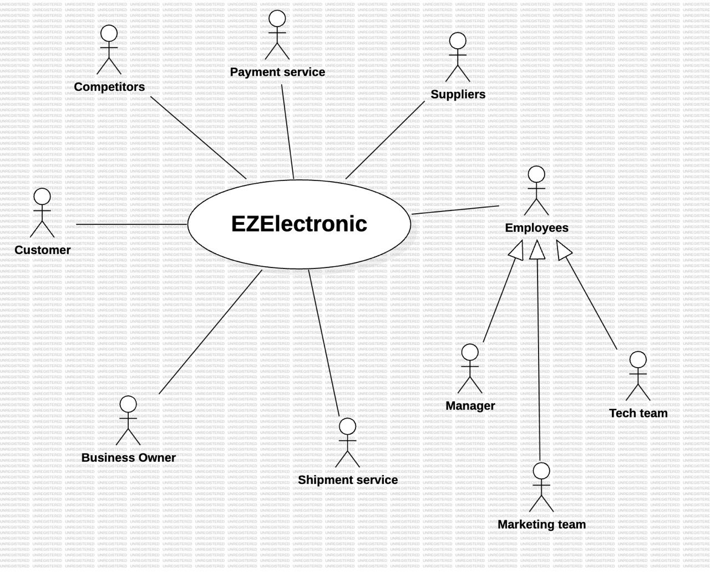

# Requirements Document - future EZElectronics

Date: 29/04/2024

Version: V2 - description of EZElectronics in FUTURE form (as proposed by the team)

| Version number |                      Change                      |
| :------------: | :-----------------------------------------------: |
|      1.4      | Added Stories and personas + initial FRs and NFRs |

# Contents

- [Requirements Document - future EZElectronics](#requirements-document---future-ezelectronics)
- [Contents](#contents)
- [Informal description](#informal-description)
- [Stakeholders](#stakeholders)
- [Context Diagram and interfaces](#context-diagram-and-interfaces)
  - [Context Diagram](#context-diagram)
  - [Interfaces](#interfaces)
- [Stories and personas](#stories-and-personas)
- [Functional and non functional requirements](#functional-and-non-functional-requirements)
  - [Functional Requirements](#functional-requirements)
  - [Non Functional Requirements](#non-functional-requirements)
- [Use case diagram and use cases](#use-case-diagram-and-use-cases)
  - [Use case diagram](#use-case-diagram)
    - [Use case 1, UC1](#use-case-1-uc1)
      - [Scenario 1.1](#scenario-11)
      - [Scenario 1.2](#scenario-12)
      - [Scenario 1.x](#scenario-1x)
    - [Use case 2, UC2](#use-case-2-uc2)
    - [Use case x, UCx](#use-case-x-ucx)
- [Glossary](#glossary)
- [System Design](#system-design)
- [Deployment Diagram](#deployment-diagram)

# Informal description

EZElectronics (read EaSy Electronics) is a software application designed to help managers of electronics stores to manage their products and offer them to customers through a dedicated website. Managers can assess the available products, record new ones, and confirm purchases. Customers can see available products, add them to a cart and see the history of their past purchases.

# Stakeholders

| Stakeholder name |                                                                  Description                                                                  |
| :--------------: | :-------------------------------------------------------------------------------------------------------------------------------------------: |
|     Manager     |                                                       Manages products and their supply                                                       |
|     Customer     |                                  People who wants to buy electronics products such as laptops or smartphones                                  |
| Payment service |                                                    Offers several ways to pay for products                                                    |
|  Business owner  |                            Company executives or stakeholders with a financial interest in the platform's success                            |
|    Suppliers    |                                        Electronics companies who provide the electronics to the store                                        |
|    Tech team    | Software engineers and IT professionals responsible for developing, maintaining the system and ensuring the security and privacy of user data |
| Shipment service |              Services offered by companies or suppliers that specialize in moving and delivering goods from one point to another              |
|  Marketing team  |                             People interested in the success of advertising campaigns and online brand visibility                             |
|   Competitors   |                                                      Rivals in the electronics industry                                                      |

# Context Diagram and interfaces

## Context Diagram

## Interfaces

|      Actor      |   Logical Interface   | Physical Interface |
| :--------------: | :--------------------: | :----------------: |
|     Customer     | the GUI of the website |   PC/Smartphone   |
|     Manager     | the GUI of the website |   PC/Smartphone   |
| Payment service |          API          |      Internet      |
| Shipment service |          API          |      Internet      |

# Stories and personas

#### **Customer Persona**

* **Name**: Alice Johnson
* **Age**: 30
* **Occupation**: Software Engineer
* **Role**: Customer
* **Background**: Alice is a frequent online shopper who likes technology gadgets. She prefers seamless experiences and is familiar with EZElectronics platforms.
* **Goals**:

  Find and purchase products quickly and easily.

  View the contents of her shopping cart and complete the checkout process without delays. see the history of last purchases.

  Track payment status and view past purchases.

#### Manager Persona

* **Name**: Bob Stevens
* **Age**: 45
* **Occupation**: Store Manager
* **Role**: Manager
* **Background**: Bob is responsible for managing the online store. He has experience in retail and supervises customer orders.
* **Goals**:

  Add, delete products in the store, check availability and mark them as paid.

  Ensure smooth operation of the EZElectronics platform.

**Customer Stories:**

Alice seeks a smooth and intuitive online shopping experience, with easy navigation, detailed product descriptions, quick addition of items to her cart, and hassle-free purchase completion.

**Manager Stories:**

Bob leads an electronics store, managing stock, purchases, and product selection. Seeking efficiency, Bob desires an intuitive application for real-time stock monitoring and easy product management. Bob also prioritizes a user-friendly interface to streamline customer transactions.

# Functional and non functional requirements

## Functional Requirements

| ID            |                                       Description                                       |
| :------------ | :--------------------------------------------------------------------------------------: |
| **FR1** |                                **Manage products**                                |
| FR1.1         |                             Add a product, delete a product                             |
| FR1.2         |                                  Mark a product as sold                                  |
| FR1.3         |                    Retrieve a list of products (by model or category)                    |
| FR1.4         |               Registers the arrival of a set of products of the same model               |
| FR1.5         |                         Filter a list of products by price, name                         |
| **FR2** |                                  **Manage carts**                                  |
| FR2.1         |            Removes a product from the current cart , Deletes the current cart            |
| FR2.2         |                                     Check out a cart                                     |
| FR2.3         |                                  View the current cart                                  |
| FR2.4         |                                Adds a product to the cart                                |
| FR2.5         |                             Returns the history of the carts                             |
| **FR3** |                        **Authorization and authentication**                        |
| FR3.1         |                                    Log in and log out                                    |
| FR3.2         |                 Retrieves information about the currently logged in user                 |
| **FR4** |                                  **Manage users**                                  |
| FR4.1         |                                      Create a user                                      |
| FR4.2         | Delete a user , retrieve a list of users by their role , retrieve a user by the username |

## Table of rights

|                    | **FR1.1 FR1.2 FR1.4** | **FR1.3** | FR2 | FR3 | FR4.1 | FR4.2 |
| :----------------: | :-----------------------------------: | :-------------: | :-: | --- | ----- | ----- |
| **Manager** |                   Y                   |        Y        |  Y  | Y   | Y     | Y     |
| **Customer** |                   N                   |        Y        |  Y  | Y   | Y     | N     |

## Non Functional Requirements

|  ID  | Type (efficiency, reliability, ..) |                                        Description                                        | Refers to |
| :--: | :--------------------------------: | :---------------------------------------------------------------------------------------: | :-------: |
| NFR1 |             Usability             |            Application should be used with no specific training for the users            |  ALL FR  |
| NFR2 |             Efficiency             |                        All functions should complete in < 0.5 sec                        |  ALL FR  |
| NFR3 |            Reliability            | The frontend service must be always up, at least to serve an information page to the user |  ALL FR  |
| NFR4 |          Maintainability          |             Adding or updating a function must always take no more than 16 ph             |  ALL FR  |
| NFR5 |            Portability            |                      The site must be usable on all kind of devices                      |  ALL FR  |
| NFR6 |              Security              | The user's password should be hashed. Only the hashed value may be stored in the database | FR3 - FR4 |
| NFR7 |              Privacy              |              The data of a customer should not be disclosed outside the site              | FR3 - FR4 |

# Use case diagram and use cases

## Use case diagram

\<define here UML Use case diagram UCD summarizing all use cases, and their relationships>

\<next describe here each use case in the UCD>

### Use case 1, UC1

| Actors Involved |                                                                      |
| :--------------: | :------------------------------------------------------------------: |
|   Precondition   | \<Boolean expression, must evaluate to true before the UC can start> |
|  Post condition  |  \<Boolean expression, must evaluate to true after UC is finished>  |
| Nominal Scenario |         \<Textual description of actions executed by the UC>         |
|     Variants     |                      \<other normal executions>                      |
|    Exceptions    |                        \<exceptions, errors >                        |

##### Scenario 1.1

\<describe here scenarios instances of UC1>

\<a scenario is a sequence of steps that corresponds to a particular execution of one use case>

\<a scenario is a more formal description of a story>

\<only relevant scenarios should be described>

|  Scenario 1.1  |                                                                            |
| :------------: | :------------------------------------------------------------------------: |
|  Precondition  | \<Boolean expression, must evaluate to true before the scenario can start> |
| Post condition |  \<Boolean expression, must evaluate to true after scenario is finished>  |
|     Step#     |                                Description                                |
|       1       |                                                                            |
|       2       |                                                                            |
|      ...      |                                                                            |

##### Scenario 1.2

##### Scenario 1.x

### Use case 2, UC2

..

### Use case x, UCx

..

# Glossary

\<use UML class diagram to define important terms, or concepts in the domain of the application, and their relationships>

\<concepts must be used consistently all over the document, ex in use cases, requirements etc>

# System Design

\<describe here system design>

\<must be consistent with Context diagram>

# Deployment Diagram

\<describe here deployment diagram >
