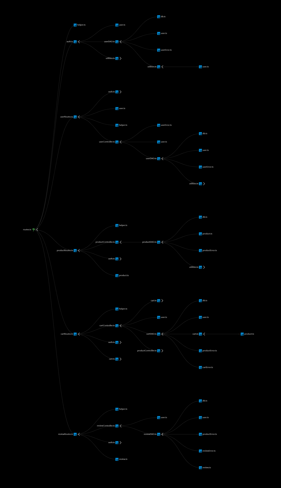
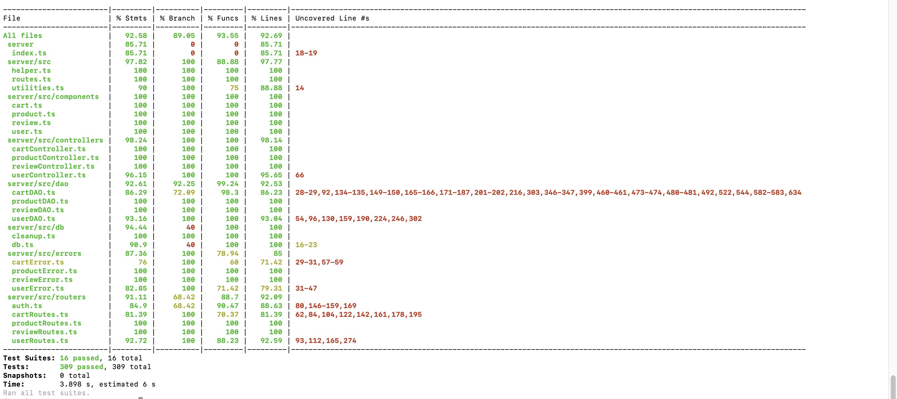

# Test Report

<The goal of this document is to explain how the application was tested, detailing how the test cases were defined and what they cover>

# Contents

- [Test Report](#test-report)
- [Contents](#contents)
- [Dependency graph](#dependency-graph)
- [Integration approach](#integration-approach)
- [Tests](#tests)
- [Coverage](#coverage)
  - [Coverage of FR](#coverage-of-fr)
  - [Coverage white box](#coverage-white-box)

# Dependency graph

# Integration approach

## Product and review part done by Mona Poursnaeil

## General Integration Sequence:

The integration testing approach adopted here follows a mixed strategy that combines unit testing, API route testing, and full integration testing. The sequence integrates various components gradually to ensure individual units work correctly before integrating them into larger subsystems and eventually the complete system.

1. **Step 1: Unit Testing of Individual Components**

   - **ProductController Unit Tests**: Ensure the `ProductController` methods (`registerProducts`, `changeProductQuantity`, `sellProduct`, `getProducts`, `getAvailableProducts`, `deleteAllProducts`, `deleteProduct`) function correctly in isolation.
     - File: `product_controller.test.ts`
   - **ReviewController Unit Tests**: Ensure the `ReviewController` methods (`addReview`, `getProductReviews`, `deleteReview`, `deleteReviewsOfProduct`, `deleteAllReviews`) function correctly in isolation.
     - File: `review_controller.test.ts`
   - **UserController Unit Tests**: Ensure the `UserController` methods (`createUser`, `getUsers`, `getUsersByRole`, `getUserByUsername`, `deleteUser`, `deleteAll`,`updateUserInfo`) function correctly in isolation.
     - File: `user_controller.test.ts`
   - **CartController Unit Tests**: Ensure the `CartController` methods (`addToCart`, `getCart`, `checkoutCart`, `getCustomerCarts`, `removeProductFromCart`, `clearCart`, `deleteAllCarts`, `getAllCarts`) function correctly in isolation.
     -File: `cart_controller.test.ts`
   - **ProductDAO Unit Tests**: Verify the `ProductDAO` methods handle database operations correctly, such as registering products, changing product quantity, selling products, and deleting products.
     - File: `product_dao.test.ts`
   - **ReviewDAO Unit Tests**: Verify the `ReviewDAO` methods handle database operations correctly, such as adding reviews, getting product reviews, and deleting reviews.
     - File: `review_dao.test.ts`
   - **UserDAO Unit Tests**: Verify the `UserDao` methods handle database operations correctly, such as creating users, getting users, deleting users and updating users.
     - File: `user_dao.test.ts`
   - **CartDao Unit Tests**: Verify the `CartDao` methods handle database operations correctly, such as getting carts, adding products to a cart, removing products from a cart, checking out a cart and deleting a carts.   
     - FILE: `cart_dao.test.ts`  

2. **Step 2: Route Testing for API Endpoints**
   - **Product Routes Testing**: Test the API endpoints for product-related operations (`POST /products`, `PATCH /products/:model`, `PATCH /products/:model/sell`, `GET /products`, `DELETE /products`, etc.) to ensure correct integration with the `ProductController`.
     - File: `product_route.test.ts`
   - **Review Routes Testing**: Test the API endpoints for review-related operations (`POST /reviews/:model`, `GET /reviews/:model`, `DELETE /reviews/:model`, `DELETE /reviews/:model/all`, `DELETE /reviews`) to ensure correct integration with the `ReviewController`.
     - File: `review_route.test.ts`
   - **User Routes Testing**: Test the API endpoints for user-related operations (`POST /users`, `GET /users`, `GET /users/roles/:role`, `GET /users/:username`, `DELETE /users/:username`, `DELETE /users`, `PATCH /users/:username`) to ensure correct integration with the `UserController`.
     - File: `user.test.ts`
   - **Cart Routes Testing**: Test the API endpoints for cart-related operations (`GET /carts, `GET /carts/all, `GET /history`, `POST /carts`, `PATCH /carts/model`, `DELETE /carts`, `DELETE /carts/current`, `DELETE /carts/current/products/:model`) to ensure correct integration with the `CartController`. 
     - File: `cart_route.test.ts`    

3. **Step 3: Full Integration Testing**
   - **Product Integration Tests**: Conduct full integration tests to validate the end-to-end functionality of product-related operations, starting from user creation and authentication to product creation, modification, and deletion.
     - File: `product_integration.test.ts`
   - **Review Integration Tests**: Conduct full integration tests to validate the end-to-end functionality of review-related operations, including adding reviews, fetching reviews, and deleting reviews.
     - File: `review_integration.test.ts`
   - **User Integration Tests**: Conduct full integration tests to validate the end-to-end functionality of user-related operations, starting from user creation and authentication to modification, retrieval and deletion.
     - File: `user_integration.test.ts`
   - **Cart Integration Tests**: Conduct full integration tests to validate the end-to-end dunctionality of cart-related operations, including cart creation, product adding, cart checkout and deletion, and retrieving cart history.
     -File: `cart_integration.test.ts`   

## Detailed Integration Sequence:

1. **Unit Testing**:
   - Step 1: `ProductController` Unit Tests
   - Step 2: `ReviewController` Unit Tests
   - Step 3: `UserController` Unit Tests
   - Step 4: `CartController` Unit Tests
   - Step 5: `ProductDAO` Unit Tests
   - Step 6: `ReviewDAO` Unit Tests
   - Step 7: `UserDao` Unit Tests
   - Step 8: `CartDao` Unit Tests

2. **Route Testing**:
   - Step 9: `product_route.test.ts` (API endpoints for product operations)
   - Step 10: `review_route.test.ts` (API endpoints for review operations)
   - Step 11: `user_route.test.ts` (API endpoints for user operations)
   - Step 12: `cart_route.test.ts` (API endpoints for cart operations)

3. **Full Integration Testing**:
   - Step 13: `product_integration.test.ts` (Full integration tests for product operations)
   - Step 14: `review_integration.test.ts` (Full integration tests for review operations)
   - Step 15: `user_integration.test.ts` (Full integration tests for user operations)
   - Step 16: `cart_integration.test.ts` (Full integration tests for cart operations)

This integration sequence ensures that each component is individually tested for correctness before being tested together with other components in the API routes and, finally, the complete system through integration tests.

# Tests

<in the table below list the test cases defined For each test report the object tested, the test level (API, integration, unit) and the technique used to define the test case (BB/ eq partitioning, BB/ boundary, WB/ statement coverage, etc)> <split the table if needed>

| Test case name                      | Object(s) tested              | Test level   | Technique used                               |
| :---------------------------------: | :---------------------------: | :----------: | :------------------------------:             |
| creating user                       | createUser method, UserDAO     | Unit         | WB/statement coverage                       |
| get all users                       | getUsers method, UserDAO       | Unit         | WB/statement coverage                       |
| get users by role                   | getUsersByRole method, UserDAO | Unit         | WB/statement coverage                       |
| get users by username               | getUserByUsername method, UserDAO | Unit     | WB/statement coverage                        |
| delete a user                       | deleteUser method, UserDAO     | Unit         | WB/statement coverage                       |
| delete all users                    | deleteAllUsers method, UserDAO | Unit         | WB/statement coverage                       | 
| update user info                    | updateUserInfo method, UserDAO | Unit         | WB/statement coverage                       |
| create user - 200                   | POST /users route, UserController | Integration | BB/equivalence partitioning               |
| create user - user already in db - 409 | POST /users route, UserController | Integration | BB/boundary value analysis             |
| get all users - route               | GET /users route, UserController | Integration | BB/equivalence partitioning                |
| get all users - user not admin - 401 | GET /users route, Authenticator | Integration | BB/boundary value analysis                 |
| get users by role - route           | GET /users/roles/:role route, UserController | Integration | BB/equivalence partitioning    |
| get users by role - user not admin - 401 | GET /users/roles/:role route, Authenticator | Integration | BB/boundary value analysis |
| get user by username - route        | GET /users/:username route, UserController | Integration | BB/equivalence partitioning      |
| get user by username - user not admin - 401 | GET /users/:username route, Authenticator | Integration | BB/boundary value analysis|
| delete a user - route               | DELETE /users/:username route, UserController | Integration | BB/equivalence partitioning   |
| delete all users - route            | DELETE /users route, UserController | Integration | BB/equivalence partitioning             |
| update a user - route               | PATCH /users/:username route, UserController | Integration | BB/equivalence partitioning    |
| update a user - user not found - 404 | PATCH /users/:username route, UserController | Integration | BB/boundary value analysis    |
| login                               | POST /sessions route, Authenticator | Integration | BB/equivalence partitioning             |
| get current session                 | GET /sessions/current route, Authenticator | Integration | BB/equivalence partitioning      |
| logout                              | DELETE /sessions/current route, Authenticator | Integration | BB/equivalence partitioning   |
| registerProducts-success                           | ProductController                      | Unit          | WB/ statement coverage      |
| change product quantity with success               | ProductController                      | Unit          | WB/ statement coverage      |
| sell product with success                          | ProductController                      | Unit          | WB/ statement coverage      |
| get products by category with success              | ProductController                      | Unit          | WB/ statement coverage      |
| get products by model with success                 | ProductController                      | Unit          | WB/ statement coverage      |
| get available products by category with success    | ProductController                      | Unit          | WB/ statement coverage      |
| get available products by model with success       | ProductController                      | Unit          | WB/ statement coverage      |
| delete all products with success                   | ProductController                      | Unit          | WB/ statement coverage      |
| delete product with success                        | ProductController                      | Unit          | WB/ statement coverage      |
| addReview                                          | ReviewController                       | Unit          | WB/ statement coverage      |
| getProductReviews                                  | ReviewController                       | Unit          | WB/ statement coverage      |
| deleteReview                                       | ReviewController                       | Unit          | WB/ statement coverage      |
| deleteReviewsOfProduct                             | ReviewController                       | Unit          | WB/ statement coverage      |
| deleteAllReviews                                   | ReviewController                       | Unit          | WB/ statement coverage      |
| Adding product to empty cart with Success          | CartController                         | Unit          | WB/ statement coverage      |
| Removing Product from Cart                         | CartController                         | Unit          | WB/ statement coverage      |
| Removing all Products from Cart                    | CartController                         | Unit          | WB/ statement coverage      |
| Retrieve Cart with element                         | CartController                         | Unit          | WB/ statement coverage      |
| Retrieve Cart with no element                      | CartController                         | Unit          | WB/ statement coverage      |
| Checkout Cart                                      | CartController                         | Unit          | WB/ statement coverage      |
| Retrieve all Carts                                 | CartController                         | Unit          | WB/ statement coverage      |
| Retrieve all Carts of a single user                | CartController                         | Unit          | WB/ statement coverage      |
| Delete all carts                                   | CartController                         | Unit          | WB/ statement coverage      |
| register product with success                      | ProductDAO                             | Unit          | WB/ statement coverage      |
| register product already exists                    | ProductDAO                             | Unit          | WB/ statement coverage      |
| register product with null details                 | ProductDAO                             | Unit          | WB/ statement coverage      |
| register product with null arrivalDate             | ProductDAO                             | Unit          | WB/ statement coverage      |
| change product quantity with success               | ProductDAO                             | Unit          | WB/ statement coverage      |
| change product quantity - product not found        | ProductDAO                             | Unit          | WB/ statement coverage      |
| change quantity - change date before arrival date  | ProductDAO                             | Unit          | WB/ statement coverage      |
| change quantity - decrease product quantity        | ProductDAO                             | Unit          | WB/ statement coverage      |
| sell product with success                          | ProductDAO                             | Unit          | WB/ statement coverage      |
| sellProduct - product not found                    | ProductDAO                             | Unit          | WB/ statement coverage      |
| sellProduct - selling date before arrival date     | ProductDAO                             | Unit          | WB/ statement coverage      |
| sellProduct - quantity more than available         | ProductDAO                             | Unit          | WB/ statement coverage      |
| get products by category                           | ProductDAO                             | Unit          | WB/ statement coverage      |
| get products by model                              | ProductDAO                             | Unit          | WB/ statement coverage      |
| get available products by category                 | ProductDAO                             | Unit          | WB/ statement coverage      |
| get available products by model                    | ProductDAO                             | Unit          | WB/ statement coverage      |
| deleteAllProducts with success                     | ProductDAO                             | Unit          | WB/ statement coverage      |
| deleteProduct with success                         | ProductDAO                             | Unit          | WB/ statement coverage      |
| addReview with success                             | ReviewDAO                              | Unit          | WB/ statement coverage      |
| getProductReviews with success                     | ReviewDAO                              | Unit          | WB/ statement coverage      |
| deleteReview with success                          | ReviewDAO                              | Unit          | WB/ statement coverage      |
| deleteReviewsOfProduct with success                | ReviewDAO                              | Unit          | WB/ statement coverage      |
| deleteAllReviews with success                      | ReviewDAO                              | Unit          | WB/ statement coverage      |
| get Cart                                           | CartDAO                                | Unit          | WB/ statement coverage      |
| addToCart                                          | CartDAO                                | Unit          | WB/ statement coverage      |
| checkoutCart                                       | CartDAO                                | Unit          | WB/ statement coverage      |
| getCustomerCarts                                   | CartDAO                                | Unit          | WB/ statement coverage      |
| removeProductFromCart                              | CartDAO                                | Unit          | WB/ statement coverage      |
| cleancart                                          | CartDAO                                | Unit          | WB/ statement coverage      |
| deleteAllCarts                                     | CartDAO                                | Unit          | WB/ statement coverage      |
| getAllCarts                                        | CartDAO                                | Unit          | WB/ statement coverage      |
| register products - 200                            | ProductController, ProductRoute        | API           | BB/ eq partitioning         |
| register products - 503                            | ProductController, ProductRoute        | API           | BB/ eq partitioning         |
| change product quantity- 200                       | ProductController, ProductRoute        | API           | BB/ eq partitioning         |
| sell product -200                                  | ProductController, ProductRoute        | API           | BB/ eq partitioning         |
| get all products - 200                             | ProductController, ProductRoute        | API           | BB/ eq partitioning         |
| delete all products - 200                          | ProductController, ProductRoute        | API           | BB/ eq partitioning         |
| delete product - 200                               | ProductController, ProductRoute        | API           | BB/ eq partitioning         |
| add review - 200                                   | ReviewController, ReviewRoute          | API           | BB/ eq partitioning         |
| get all reviews -200                               | ReviewController, ReviewRoute          | API           | BB/ eq partitioning         |
| delete a review-200                                | ReviewController, ReviewRoute          | API           | BB/ eq partitioning         |
| delete all reviews of a product - 200              | ReviewController, ReviewRoute          | API           | BB/ eq partitioning         |
| delete all reviews - 200                           | ReviewController, ReviewRoute          | API           | BB/ eq partitioning         |
| get cart - 200 - 401                               | CartController, CartRoute              | API           | BB/ eq partitioning         |
| Add product to cart - 200 - 401                    | CartController, CartRoute              | API           | BB/ eq partitioning         |
| Add product to cart - 422                          | CartController, CartRoute              | API           | BB/ boundary                |
| checkoutcart - 200 - 401                           | CartController, CartRoute              | API           | BB/ eq partitioning         |
| customer cart history - 200 - 401                  | CartController, CartRoute              | API           | BB/ eq partitioning         |
| remove product from a cart - 200 - 401             | CartController, CartRoute              | API           | BB/ eq partitioning         |
| remove product from a cart - 404                   | CartController, CartRoute              | API           | BB/ boundary                |
| Clear current cart - 200 - 401                     | CartController, CartRoute              | API           | BB/ eq partitioning         |
| Delete all carts - 200 - 401                       | CartController, CartRoute              | API           | BB/ eq partitioning         |
| Get all carts - 200 - 401                          | CartController, CartRoute              | API           | BB/ eq partitioning         |
| POST /products - 200                               | ProductController, ProductDAO, API     | Integration   | BB/ eq partitioning         |
| POST /products - 422                               | ProductController, ProductDAO, API     | Integration   | BB/ boundary                |
| POST /products - 409                               | ProductController, ProductDAO, API     | Integration   | BB/ eq partitioning         |
| PATCH /products/:model - 200                       | ProductController, ProductDAO, API     | Integration   | BB/ eq partitioning         |
| PATCH /products/:model - 404                       | ProductController, ProductDAO, API     | Integration   | BB/ eq partitioning         |
| PATCH /products/:model/sell - 200                  | ProductController, ProductDAO, API     | Integration   | BB/ eq partitioning         |
| PATCH /products/:model/sell - 404                  | ProductController, ProductDAO, API     | Integration   | BB/ eq partitioning         |
| GET /products - 200                                | ProductController, ProductDAO, API     | Integration   | BB/ eq partitioning         |
| DELETE /products/:model - 200                      | ProductController, ProductDAO, API     | Integration   | BB/ eq partitioning         |
| DELETE /products/:model - 404                      | ProductController, ProductDAO, API     | Integration   | BB/ eq partitioning         |
| POST /reviews/:model - 200                         | ReviewController, ReviewDAO, API       | Integration   | BB/ eq partitioning         |
| POST /reviews/:model - 422                         | ReviewController, ReviewDAO, API       | Integration   | BB/ boundary                |
| POST /reviews/:model - 404                         | ReviewController, ReviewDAO, API       | Integration   | BB/ eq partitioning         |
| POST /reviews/:model - 409                         | ReviewController, ReviewDAO, API       | Integration   | BB/ eq partitioning         |
| GET /reviews/:model - 200                          | ReviewController, ReviewDAO, API       | Integration   | BB/ eq partitioning         |
| DELETE /reviews/:model - 200                       | ReviewController, ReviewDAO, API       | Integration   | BB/ eq partitioning         |
| DELETE /reviews/:model - 404                       | ReviewController, ReviewDAO, API       | Integration   | BB/ eq partitioning         |
| DELETE /reviews/:model/all - 200                   | ReviewController, ReviewDAO, API       | Integration   | BB/ eq partitioning         |
| DELETE /reviews/:model/all - 404                   | ReviewController, ReviewDAO, API       | Integration   | BB/ eq partitioning         |
| DELETE /reviews - 200                              | ReviewController, ReviewDAO, API       | Integration   | BB/ eq partitioning         |
| GET /history                                       | CartController, CartDAO, API           | Integration   | BB/ eq partitioning         |
| GET /carts                                         | CartController, CartDAO, API           | Integration   | BB/ eq partitioning         |
| POST /carts - 200                                  | CartController, CartDAO, API           | Integration   | BB/ eq partitioning         |
| POST /carts - 422                                  | CartController, CartDAO, API           | Integration   | BB/ boundary         |
| POST /carts - 401                                  | CartController, CartDAO, API           | Integration   | BB/ eq partitioning         |
| POST /carts - 404                                  | CartController, CartDAO, API           | Integration   | BB/ eq partitioning         |
| PATCH /carts/:model                                | CartController, CartDAO, API           | Integration   | BB/ eq partitioning         |
| DELETE /carts/products/:model                      | CartController, CartDAO, API           | Integration   | BB/ eq partitioning         |
| DELETE /carts/current                              | CartController, CartDAO, API           | Integration   | BB/ eq partitioning         |
| DELETE /carts                                      | CartController, CartDAO, API           | Integration   | BB/ eq partitioning         |
| GET /carts/all                                     | CartController, CartDAO, API           | Integration   | BB/ eq partitioning         |

# Coverage

## Coverage of FR

<Report in the following table the coverage of functional requirements and scenarios(from official requirements) >

| Functional Requirement or scenario       | Test(s)                                                                                               |
| :--------------------------------------: | :-------------------------------------------------------------------------------------:               |
| 1: Manange account                       |                                                                                                       |
| 1.1: User login                               | login, POST ezelectronics/sessions                                                               |
| 1.2: Logging out                              | logout, DELETE ezelectronics/sessions/current                                                    |
| 1.3: Creating a user                          | creating user, create user - 200, create user - user already in db - 409                         |
| 2: Manange users                              |                                                                                                  |
| 2.1: Retrieving all users                     | get all users, get all users - route, get all users - user not admin - 401                       |
| 2.2: Retrieving users by role                 | get users by role, get users by role - route, get users by role - user not admin - 401           |
| 2.3: Retrieving a user by username            | get users by username, get user by username - route, get user by username - user not admin - 401 |
| 2.4: Updating user info                       | update user info, update a user, update a user - user not found - 404, update a user - username does not match - 401, update a user - birthdate error - 400 |
| 2.5: Deleting a user                          | delete a user, delete a user - route, delete a user - 503                                   |
| 2.6: Deleting all users                       | delete all users, delete all users - route                                                  |
| FR3: Manage products                                         |                                                                              |
| FR3.1: Register a set of new products                        | registerProducts-success, POST /products - 200, POST /products - 422          |
| FR3.2: Update the quantity of a product                      | change product quantity with success, PATCH /products/:model - 200, PATCH /products/:model - 404 |
| FR3.3: Sell a product                                        | sell product with success, PATCH /products/:model/sell - 200, PATCH /products/:model/sell - 404 |
| FR3.4: Show the list of all products                         | get all products by category with success, get products by model with success, GET /products - 200 |
| FR3.4.1: Show the list of all available products             | get available products by category with success, get available products by model with success |
| FR3.5: Show the list of all products with the same category  | get products by category with success                                         |
| FR3.5.1: Show the list of all available products with the same category | get available products by category with success                               |
| FR3.6: Show the list of all products with the same model     | get products by model with success                                            |
| FR3.6.1: Show the list of all available products with the same model | get available products by model with success                                  |
| FR3.7: Delete a product                                      | delete product with success, DELETE /products/:model - 200, DELETE /products/:model - 404 |
| FR3.8: Delete all products                                   | delete all products with success, DELETE /products - 200                      |
| FR4: Manage reviews                                          |                                                                              |
| FR4.1: Add a new review to a product                         | addReview, add review - 200, POST /reviews/:model - 200, POST /reviews/:model - 422 |
| FR4.2: Get the list of all reviews assigned to a product     | getProductReviews, get all reviews - 200, GET /reviews/:model - 200           |
| FR4.3: Delete a review given to a product                    | deleteReview, delete a review - 200, DELETE /reviews/:model - 200, DELETE /reviews/:model - 404 |
| FR4.4: Delete all reviews of a product                       | deleteReviewsOfProduct, delete all reviews of a product - 200, DELETE /reviews/:model/all - 200 |
| FR4.5: Delete all reviews of all products                    | deleteAllReviews, delete all reviews - 200                                    |
| FR5: manage carts                                          |                                                                              |
| FR5.1: Show the information of the current cart              | Retrieve Cart with element, Retrieve Cart with no element, getCart (dao & route), GET /carts |
| FR5.2: Add a product to the current cart                     | Adding product to empty cart with Success, addToCart, Add product to cart, POST /carts |
| FR5.3: Checkout the current cart                             | checkoutcart (Dao & route & controller), PATCH /carts/:model|
| FR5.4: Show the history of the paid carts                    | customer cart history, GET /history|
| FR5.5: Remove a product from the current cart                | Removing Product from Cart, Removing all Products from Cart, removeProductFromCart, remove product from a cart, DELETE /carts/products/:model|
| FR5.6: Delete the current cart                               | cleancart, Clear current cart, DELETE /carts/current|
| FR5.7: See the list of all carts of all users                | Retrieve all Carts, getAllCarts, Get all carts, GET /carts/all |
| FR5.8: Delete all carts                                      | deleteAllCarts, Delete all carts (Route & controller), DELETE /carts|

## Coverage white box

